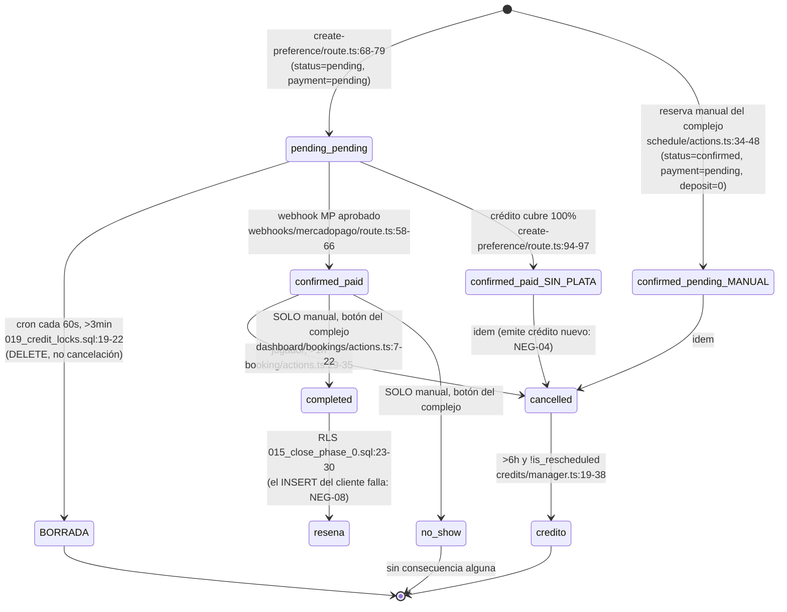

# Auditoría de Lógica de Negocio — Ronda 2

- **Fecha:** 2026-09-01
- **Commit base:** `a1f7e7f` (working tree con 148 archivos modificados — se audita el árbol de trabajo, no el commit limpio)
- **Alcance:** reglas de negocio declaradas en `AGENTS.md` contra la implementación real (TS + SQL). Sin red, sin servidores. Se ejecutó únicamente la suite local de Vitest para verificar el estado de los tests de negocio.
- **Perfil del auditor:** abogado del diablo. No hay felicitaciones fuera de la sección explícita de aciertos.

---

## Resumen ejecutivo

**Este negocio, tal como está en el código, no gana un solo peso.** No existe la palabra `commission`, `fee`, `platform_fee`, `payout` ni `marketplace_fee` en ningún archivo del repositorio: ni en las 20 migraciones, ni en el modelo de datos, ni en la preferencia de Mercado Pago (`src/lib/mercadopago/client.ts:32-57` crea un ítem simple, sin `marketplace_fee` y sin `collector_id` del complejo). La única señal de un modelo económico está en `src/app/admin/page.tsx:24`, donde el dashboard de plataforma computa su "ingreso" como `total_price * 0.3` — es decir, **la plataforma contabiliza como propia la seña que le pertenece al complejo**, y ni siquiera existe un mecanismo para girarle al complejo su parte. No hay tabla de liquidaciones, no hay registro del 70% restante, no hay `deposit_method` escrito por el flujo de plataforma. La plata entra a una cuenta de MP y muere ahí, contablemente hablando.

**No sobrevive al primer venue_admin vivo, y no hace falta que sea vivo.** El panel del complejo tiene un interruptor rotulado "Exigir Seña Obligatoria" (`src/components/dashboard/venue/venue-forms.tsx:152-161`) que, apagado, hace que `src/app/api/booking/create-preference/route.ts:58,94-103` confirme la reserva como `paid` sin cobrar nada y sin pasar por Mercado Pago. Y el buscador **promociona activamente** esa configuración con un filtro "Sin seña" (`src/app/(main)/search/page.tsx:101`, `src/components/venue/venue-card.tsx:73`). El producto le regala al complejo el botón de la desintermediación y después lo usa como argumento de venta al jugador.

A eso se le suma: reservas manuales ilimitadas y sin seña para bloquear el inventario (`src/app/dashboard/schedule/actions.ts:34-48`), la capacidad del dueño de **reescribir el puntaje y el texto de las reseñas de su propio complejo** por una política RLS sin `WITH CHECK` (`supabase/migrations/002_rls_policies.sql:103-106`), un loop de farmeo de crédito infinito, la reprogramación que directamente **no existe** (el diálogo dice "en desarrollo") y un bug de zona horaria de 3 horas que le esconde al jugador el botón de cancelar. Los tests de negocio están en rojo: 3 de 5 fallan hoy en esta máquina.

Veredicto: hay un producto razonablemente construido a nivel técnico montado sobre un modelo de negocio que todavía no fue diseñado.

---

## Regla declarada vs. Implementación real

| Regla (`AGENTS.md`) | ¿Implementada? | Evidencia | Riesgo |
|---|---|---|---|
| **Seña: mínimo 30% del total** | **Contradictoria** | `supabase/migrations/007_venue_deposit_settings.sql:4` permite `deposit_percentage >= 0`; `src/app/dashboard/venue/actions.ts:78` no valida piso; `src/lib/utils/currency.test.ts:37` **testea explícitamente que 0% devuelve 0**. El "30%" canónico de `src/lib/mercadopago/helpers.ts:6` es código muerto (sin llamadores). | Crítico — el piso de negocio no existe en ninguna capa |
| **Seña: siempre digital vía Mercado Pago** | **No** | `src/components/booking/booking-wizard.tsx:224-228` ofrece "Transferencia"; la rama de `booking-wizard.tsx:79-83` no crea reserva, no llama a MP y muestra un toast "Éxito". `require_deposit=false` confirma reservas sin ningún pago (`create-preference/route.ts:94-103`). | Crítico |
| **Cancelación > 6h → crédito de plataforma** | **Parcial / Contradictoria** | Ventana implementada en `src/lib/credits/manager.ts:19-38` (correcta, `hoursUntilBooking` fija `-03:00` en `src/lib/utils/dates.ts:60`). Pero el crédito **no es de plataforma**: está atado a un `venue_id` (`supabase/migrations/006_credits_venue_id.sql:2`, `manager.ts:92`). Y `manager.ts:21-28` niega el crédito a toda reserva reprogramada. | Crítico (modelo económico) |
| **Crédito vence a 90 días** | **Sí, de hecho** | `manager.ts:62-63` fija `expires_at`; `manager.ts:95,118` filtran por `expires_at`. La Edge Function `supabase/functions/expire-credits/index.ts` que marca `status='expired'` **nunca fue agendada** (no hay `cron.schedule` para ella ni `vercel.json`), pero el filtro en lectura hace cumplir el vencimiento. | Bajo (cosmético: el saldo mostrado en `credits-list.tsx:26-29` sí queda inflado) |
| **Cancelación < 6h → pierde la seña** | **Parcial** | `manager.ts:40-46` implementa el forfeit. Pero `manager.ts:9-16` agrega una regla no declarada: **con menos de 1 hora no se puede cancelar en absoluto**. Y `src/app/(main)/bookings/page.tsx:41-54` esconde el botón de cancelar 3 horas antes por bug de TZ. | Alto (consumidor) |
| **Reprogramación hasta 2h antes, sin costo** | **No** | `src/components/booking/reschedule-dialog.tsx:58-61`: "Funcionalidad de reprogramación en desarrollo". `rescheduleBooking` (`src/lib/booking/actions.ts:59`) **no tiene ningún llamador** en todo el repo. | Alto |
| **Reseñas: sólo con reserva completada** | **No (feature rota) + evadible** | `src/components/venue/review-section.tsx:55-61` inserta sin `booking_id`, que es `NOT NULL UNIQUE` (`001_initial_schema.sql:90`) → **todo insert falla**. Nadie marca `completed` automáticamente. Y la RLS (`015_close_phase_0.sql:23-30`) no valida que `venue_id` corresponda al venue del booking. | Crítico (confianza) |
| **Roles: player / venue_admin / platform_admin** | **Parcial** | Gates de layout correctos (`src/app/admin/layout.tsx:26`, `src/app/dashboard/layout.tsx:25`). Pero **no existe forma de promover a nadie**: `src/app/admin/users/page.tsx:66` es un `<Button>` sin `onClick`. Y los permisos reales no dependen del rol sino de `venues.owner_id`, que cualquier autenticado puede fijar (`002_rls_policies.sql:33-34`). | Alto |

---

## Tabla de hallazgos

### Críticos

| ID | Título | Ubicación |
|---|---|---|
| NEG-01 | El marketplace no cobra comisión: no existe en el modelo de datos, en MP, ni en el código | `src/lib/mercadopago/client.ts:32-57`, `supabase/migrations/*`, `src/app/admin/page.tsx:24` |
| NEG-02 | Interruptor "Sin seña" + filtro de búsqueda: desintermediación total con dos clics | `src/components/dashboard/venue/venue-forms.tsx:152-161`, `src/app/api/booking/create-preference/route.ts:58,94-103`, `src/app/(main)/search/page.tsx:101` |
| NEG-03 | Reservas manuales ilimitadas, sin seña y con precio libre: el bloqueo de inventario es gratis | `src/app/dashboard/schedule/actions.ts:34-48` |
| NEG-04 | Farming de crédito infinito con expiración auto-renovable | `src/app/api/booking/create-preference/route.ts:63-103` + `src/lib/credits/manager.ts:31-37,62-63` |
| NEG-05 | El crédito lo emite la plataforma con plata que retiene, y lo paga el complejo | `supabase/migrations/006_credits_venue_id.sql:2`, `src/lib/credits/manager.ts:85-104`, `src/lib/mercadopago/client.ts:4-7` |
| NEG-06 | El venue_admin puede reescribir rating y comentario de las reseñas de su complejo | `supabase/migrations/002_rls_policies.sql:103-106` |
| NEG-07 | El venue_admin puede autofabricarse reseñas 5★ ilimitadas | `src/app/dashboard/schedule/actions.ts:36`, `src/app/dashboard/bookings/actions.ts:7-22`, `supabase/migrations/015_close_phase_0.sql:23-30` |

### Altos

| ID | Título | Ubicación |
|---|---|---|
| NEG-08 | El embudo de reseñas está roto en tres puntos independientes | `src/components/venue/review-section.tsx:55-61`, `001_initial_schema.sql:90`, `src/app/dashboard/bookings/actions.ts:7` |
| NEG-09 | La reprogramación no existe; `017_reschedule_loophole.sql` tapa un agujero de una feature desconectada | `src/components/booking/reschedule-dialog.tsx:58-61`, `src/lib/booking/actions.ts:59` |
| NEG-10 | Bug de zona horaria de 3h: toda reserva de las próximas 3 horas se muestra como "Completada" y pierde el botón Cancelar | `src/app/(main)/bookings/page.tsx:41-54,61,114-126` |
| NEG-11 | `updateBookingStatus` / `updatePaymentStatus`: sin dueño, sin máquina de estados, sin plata | `src/app/dashboard/bookings/actions.ts:7-39` |
| NEG-12 | El diálogo de cancelación promete un 30% que puede no ser el que se cobró | `src/components/booking/cancel-dialog.tsx:35,96,104` |
| NEG-13 | "Transferencia" muestra "Éxito" y no crea ninguna reserva | `src/components/booking/booking-wizard.tsx:79-83` |
| NEG-14 | Sin piso de seña: 0% y 100% son configuraciones válidas | `supabase/migrations/007_venue_deposit_settings.sql:4`, `src/app/dashboard/venue/actions.ts:78` |
| NEG-15 | `rescheduleBooking` (si se conectara) no recalcula precio, no limita cantidad, no valida estado ni fecha pasada | `src/lib/booking/actions.ts:59-104` |
| NEG-16 | El cron de reservas abandonadas volvió a 3 minutos: la migración 019 revirtió en silencio el fix de la 016 | `supabase/migrations/019_credit_locks.sql:15,22` vs `016_extend_booking_cron.sql:10` |
| NEG-17 | Si falta el token de producción de MP, el pago redirige a una página borrada (404) | `src/lib/mercadopago/client.ts:22-28` + `src/app/(main)/mock-payment/page.tsx` (eliminada) |

### Medios

| ID | Título | Ubicación |
|---|---|---|
| NEG-18 | Precio no determinista con ofertas solapadas + fallback mágico de $15.000 | `src/app/api/booking/create-preference/route.ts:34-49`, `src/app/(main)/booking/[courtId]/page.tsx:50-73`, `src/app/dashboard/courts/actions.ts:117-148` |
| NEG-19 | `saveOffers` no valida el descuento en el servidor: promo de 100% o negativa | `src/app/dashboard/courts/actions.ts:111-148` |
| NEG-20 | Grilla de disponibilidad hardcodeada 14–23h: el inventario matutino queda fuera de la plataforma por diseño | `src/components/venue/availability-grid.tsx:33-34` |
| NEG-21 | Métricas de ingresos falsas en ambos dashboards | `src/app/dashboard/page.tsx:52-58`, `src/app/admin/page.tsx:19-24` |
| NEG-22 | El panel de plataforma es decorativo: no se puede promover, banear, suspender ni moderar | `src/app/admin/users/page.tsx:65-69`, `src/app/admin/venues/page.tsx:67-68`, `src/app/admin/moderation/page.tsx:50-57` |
| NEG-23 | Sin verificación de complejos: cualquier cuenta publica un complejo activo en el marketplace | `supabase/migrations/001_initial_schema.sql:32`, `002_rls_policies.sql:33-34` |
| NEG-24 | Reseña cruzada: se puede calificar al Complejo B con una reserva del Complejo A | `supabase/migrations/015_close_phase_0.sql:23-30` |
| NEG-25 | Un jugador puede mudar su reserva a otra cancha más cara sin pagar la diferencia | `supabase/migrations/018_fix_triggers_auth.sql:31-82` |
| NEG-26 | Sin `/terminos`: los enlaces legales van a 404 y no hay botón de arrepentimiento | `src/app/(auth)/login/page.tsx:132-134`, `src/components/search/search-layout.tsx:80` |
| NEG-27 | La suite de tests de negocio está en rojo (3/5) y depende de la zona horaria de la máquina | `src/lib/credits/manager.test.ts` |
| NEG-28 | Huecos de producto sin modelo de datos: no-show, reembolsos, disputas, AFIP, lluvia, feriados, temporada | transversal |
| NEG-29 | `end_time` hardcodeado en `23:59:00` para toda reserva de plataforma | `src/app/api/booking/create-preference/route.ts:74`, `src/app/dashboard/schedule/actions.ts:40` |

### Opiniones de negocio (no defectos de implementación)

| ID | Título |
|---|---|
| NEG-30 | **OPINIÓN**: la ventana de 3 minutos para pagar es un asesino de conversión |
| NEG-31 | **OPINIÓN**: "con menos de 1h no se puede cancelar" es una regla inventada, hostil y probablemente indefendible |
| NEG-32 | **OPINIÓN**: el crédito atado a un venue es un cupón de fidelización del complejo, no un crédito de plataforma |

---

## Detalle por hallazgo

### NEG-01 — El marketplace no cobra comisión (CRÍTICO)

**Ubicación:** `src/lib/mercadopago/client.ts:32-57`, `src/app/admin/page.tsx:22-24`, todo `supabase/migrations/`.

Búsqueda exhaustiva sobre el repo (excluyendo `node_modules`, `.next`, `audit-reports`, `package-lock.json`) de `commission|platform_fee|fee|comision|payout|split|marketplace_fee|application_fee`: **cero coincidencias semánticas**. Los únicos hits son `String.split()`.

La preferencia de pago:

```ts
// src/lib/mercadopago/client.ts:32-42
const result = await preference.create({
  body: {
    items: [ { id: bookingId, title, quantity: 1, unit_price: Number(price.toFixed(2)), currency_id: 'ARS' } ],
```

No hay `marketplace_fee`. No hay `collector_id`. El `MercadoPagoConfig` se instancia una sola vez a nivel de módulo con un único `MERCADOPAGO_ACCESS_TOKEN` de entorno (`src/lib/mercadopago/client.ts:4-7`): **toda seña de todo complejo entra a una única cuenta de Mercado Pago, la de la plataforma.**

Y del otro lado del flujo, no existe ninguna contrapartida: no hay tabla `payouts`, `settlements`, `transfers` ni `invoices`; `bookings.deposit_method` nunca se escribe en el flujo de plataforma (`create-preference/route.ts:68-79` no lo setea) y no hay ningún campo que registre el 70% restante ni su cobro en el complejo.

La confesión está en el dashboard de plataforma:

```ts
// src/app/admin/page.tsx:22-24
const totalRevenue = bookingsList
  .filter((b) => b.status === 'confirmed' || b.payment_status === 'paid')
  .reduce((acc, curr) => acc + (curr.total_price * 0.3), 0)
```

La plataforma llama "Ingresos" al 30% que es del complejo. No es una comisión: es plata ajena en tránsito, sin obligación registrada de devolverla y sin mecanismo para hacerlo.

**Exploit de negocio (paso a paso, y acá el que pierde es la plataforma sin que nadie ataque):**
1. Un complejo se suma. Los jugadores reservan y pagan la seña. La plata cae en la cuenta de MP de ReservaYa.
2. A fin de mes el dueño llama y pide su plata. No hay reporte por complejo, no hay liquidación, no hay retención documentada. Alguien transfiere a mano desde MP.
3. Como no hay comisión pactada ni descontada, la plataforma transfiere el 100% de lo recaudado, o se queda con algo sin base contractual (recordemos: no hay `/terminos`, NEG-26). Ambas salidas son malas.
4. Escala: con 10 complejos, esto son 10 conciliaciones manuales mensuales sobre una cuenta única de MP, sin trazabilidad por venue. El primer error de conciliación termina en un complejo que se va.

**Números (supuestos explícitos, no medidos):**
- Precio de turno F5 nocturno en La Plata: **$15.000** (es el propio fallback del código, `create-preference/route.ts:41`).
- Complejo tipo: 3 canchas × 8 turnos vendibles/día × 30 días = 720 turnos/mes; ocupación **60%** → ~430 turnos/mes → **GMV ≈ $6.480.000/mes por complejo**.
- Comisión de mercado para marketplaces de reservas: **8%** del GMV (supuesto).
- **Ingreso no facturado: ≈ $518.000/mes por complejo.** Con 10 complejos, ≈ **$5,2M/mes** que el producto no tiene forma de cobrar.
- Alternativa "comisión sobre seña" (más realista y auditable): 10% sobre la seña de $4.500 = $450/reserva → **$193.000/mes con 10 complejos**. Tampoco existe.

**Remediación descriptiva:** definir primero el modelo (take rate sobre GMV vs. sobre seña vs. abono mensual por complejo). Después, en el código: usar Mercado Pago Marketplace con `collector_id` por complejo y `marketplace_fee` calculado en el servidor, de modo que el split ocurra en MP y no en una planilla; agregar al esquema una tabla de liquidaciones que registre, por reserva, monto bruto, comisión, neto al complejo y estado de giro; y persistir en `bookings` el desglose (seña cobrada, saldo a cobrar en el complejo, comisión aplicada) como snapshot inmutable en el momento de la reserva.

---

### NEG-02 — El interruptor de la desintermediación (CRÍTICO)

**Ubicación:** `src/components/dashboard/venue/venue-forms.tsx:143-161`, `src/app/api/booking/create-preference/route.ts:54-103`, `src/app/(main)/search/page.tsx:101`, `src/components/venue/venue-card.tsx:70-74`.

El panel del complejo:

```tsx
// src/components/dashboard/venue/venue-forms.tsx:145-148
<label className="text-base font-semibold">Exigir Seña Obligatoria</label>
<p className="text-sm text-muted-foreground">
  Al desactivarlo, los jugadores podrán confirmar turnos sin pagar por adelantado.
</p>
```

El servidor obedece sin chistar:

```ts
// src/app/api/booking/create-preference/route.ts:54-59,94-103
const requireDeposit = court.venues?.require_deposit ?? true
const depositPercentage = court.venues?.deposit_percentage ?? 30
const depositAmount = requireDeposit ? Math.ceil((price * depositPercentage) / 100) : 0
let amountToPay = depositAmount
...
if (amountToPay === 0) {
  await adminSupabase.from('bookings')
    .update({ status: 'confirmed', payment_status: 'paid' } as never)
    .eq('id', bookingId)
  return NextResponse.json({ preferenceId: null, initPoint: `/booking/${courtId}/success?booking_id=${bookingId}` })
}
```

Se marca `payment_status: 'paid'` sin que haya existido pago alguno. Y el buscador convierte esa configuración en una ventaja competitiva para el complejo:

```ts
// src/app/(main)/search/page.tsx:101
const hasMatchingDeposit = requireDepositFilter === null || venue.require_deposit === requireDepositFilter
```

```tsx
// src/components/venue/venue-card.tsx:73
{venue.require_deposit ? "Con seña" : "Sin seña"}
```

**Exploit de negocio:**
1. Día 1: el complejo entra a ReservaYa con seña al 30%. Consigue jugadores nuevos que no lo conocían. Costo de adquisición pagado por la plataforma (SEO, ads, la app).
2. Día 30: ya tiene los teléfonos de esos jugadores (el chat de la plataforma se los dio; ver `src/components/chat/player-chat-modal.tsx`) y su número está publicado en la ficha pública del complejo.
3. Día 31: apaga "Exigir Seña Obligatoria". A partir de acá **ninguna reserva pasa por Mercado Pago**. La plataforma es un calendario gratis.
4. Bonus: al apagarlo, su ficha gana el badge "Sin seña" y aparece en el filtro que los jugadores prefieren. **La plataforma le premia con más tráfico al complejo que dejó de generarle cualquier ingreso.**
5. Costo para la plataforma con los supuestos de NEG-01: los $518.000/mes de comisión potencial de ese complejo, más el costo de adquisición de los jugadores que ahora atiende por WhatsApp.

**Remediación descriptiva:** si el modelo es comisión sobre seña, `require_deposit=false` es incompatible con el negocio y no debería ser una opción del complejo sino, a lo sumo, una excepción comercial que otorgue la plataforma. Si igual se quiere ofrecer, tiene que venir atado a un plan pago (abono fijo) que reemplace el ingreso variable, y jamás debería ser un factor de ranking positivo en la búsqueda.

---

### NEG-03 — Reservas manuales: el bloqueo de inventario es gratis (CRÍTICO)

**Ubicación:** `src/app/dashboard/schedule/actions.ts:7-56`, `src/components/dashboard/schedule/manual-booking-modal.tsx`.

```ts
// src/app/dashboard/schedule/actions.ts:34-48
const { error } = await supabase.from("bookings").insert({
  user_id: user.id,          // el propio dueño
  court_id: courtId,
  booking_date: date,
  start_time: time,
  end_time: "23:59:00",      // MVP simplify
  total_price: price,        // lo que el dueño escriba; default 0 si no parsea
  deposit_amount: 0,
  deposit_method: "cash",
  payment_status: "pending",
  status: "confirmed",
  source: "manual",
  manual_client_name: clientName
})
```

Existe `bookings.source` (`001_initial_schema.sql:78`) con valores `platform | manual`, o sea que alguien pensó en medir esto. **Pero nadie lo mide.** No hay ninguna consulta, métrica, alerta o penalidad basada en `source` en todo el repositorio: los dashboards (`src/app/dashboard/page.tsx:43-58`, `src/app/admin/page.tsx:17-24`) mezclan manuales y de plataforma sin distinguirlas, y el "Ingresos Estimados" del complejo suma el precio que el propio dueño tipeó a mano.

Tampoco hay límite de cantidad, ni validación de fecha pasada, ni tope de horizonte: se puede cargar todo el año.

**Exploit de negocio:**
1. El dueño abre el panel, "Nuevo Turno", y carga los 8 turnos de prime time de sus 3 canchas para los próximos 30 días. Son ~720 inserts; con un script contra la misma Server Action, minutos.
2. La grilla pública (`availability-grid.tsx`, que lee `get_venue_availability` y filtra `status != 'cancelled'`) muestra el complejo lleno. El complejo sigue apareciendo en búsqueda y en el mapa, gratis, capturando la intención de compra.
3. El jugador que quiere ese complejo ve todo ocupado y llama por teléfono — el teléfono está publicado en la ficha. El dueño le vende el turno por WhatsApp, sin seña y sin comisión.
4. Contra los supuestos de NEG-01: el 100% del GMV de ese complejo (**$6.480.000/mes**) sale del sistema, y la plataforma paga el hosting, el SEO y el soporte para que eso pase.
5. Variante más sutil y más difícil de detectar: bloquear sólo los sábados de 20 a 23. Se lleva el margen alto y deja los turnos muertos en la plataforma, que además queda con una tasa de conversión pésima porque muestra inventario que nadie quiere.

**Remediación descriptiva:** las reservas manuales son necesarias (el complejo tiene clientes de toda la vida), pero no pueden ser gratis ni invisibles. Como mínimo: métrica de ratio `manual/platform` por complejo visible para el `platform_admin` con alerta cuando supera un umbral; comisión aplicable también a la reserva manual si el modelo es por turno gestionado; un tope de turnos manuales sobre el total del mes según el plan; y auditoría de quién y cuándo cargó cada manual. La defensa contractual (cláusula anti-desintermediación) no sirve de nada si el producto no genera la evidencia.

---

### NEG-04 — Farming de crédito infinito con vencimiento auto-renovable (CRÍTICO)

**Ubicación:** `src/app/api/booking/create-preference/route.ts:62-103`, `src/lib/credits/manager.ts:31-37,59-83`, `src/lib/booking/actions.ts:29-43`.

Los créditos pueden cubrir el 100% de la seña, y en ese caso la reserva se confirma como pagada:

```ts
// src/app/api/booking/create-preference/route.ts:62-65
const credits = await getAvailableCredits(user.id, venueId)
if (credits > 0 && amountToPay > 0) {
  amountToPay = credits >= depositAmount ? 0 : depositAmount - credits
}
```

La reserva queda con `deposit_amount` = la seña completa (`route.ts:76`), aunque no haya entrado un peso. Y la política de cancelación devuelve exactamente ese `deposit_amount`:

```ts
// src/lib/credits/manager.ts:30-37
const depositAmount = booking.deposit_amount || 0;
return { canCancel: true, refundType: 'credit', creditAmount: depositAmount, ... }
```

Y el crédito nuevo nace con 90 días **desde hoy**, no desde el crédito original:

```ts
// src/lib/credits/manager.ts:62-63
const expiresAt = new Date()
expiresAt.setDate(expiresAt.getDate() + 90) // 90 días de validez
```

**Exploit de negocio (lo hace un jugador cualquiera, sin herramientas):**
1. El jugador tiene $4.500 de crédito en el Complejo X (por una cancelación legítima).
2. Reserva un turno cualquiera de ese complejo para dentro de 8 días. La seña es $4.500, la cubre el crédito, `amountToPay === 0`, la reserva sale `confirmed` + `paid` con `deposit_amount = 4500`.
3. Al otro día cancela. Faltan más de 6 horas, `is_rescheduled` es `false` (la reprogramación ni siquiera existe, NEG-09), así que `refundType = 'credit'` y se emite un crédito nuevo de **$4.500 con vencimiento a 90 días desde hoy**.
4. Volver al paso 2. **El crédito nunca vence.** El único límite es la paciencia.
5. Peor: mientras el ciclo está abierto, cada iteración bloquea un turno real del complejo durante horas o días (el índice único parcial de `008_fix_booking_constraint.sql:8-10` reserva el slot mientras el `status` no sea `cancelled`). Un jugador molesto puede sostener 2 o 3 turnos de prime time en rotación permanente sin pagar nada, para siempre.
6. Costo para el complejo con los supuestos de NEG-01: cada turno de prime time bloqueado y no vendido son **$15.000**. Un solo actor rotando 3 turnos de sábado durante un mes: **~$180.000** de lucro cesante, con cero costo para el atacante.

Nota: la plataforma no pierde plata directa en este loop (nunca la devolvió), pero pierde el complejo.

**Remediación descriptiva:** dos cambios independientes, cualquiera de los dos corta el loop. (a) El crédito emitido en una cancelación no puede exceder el **dinero efectivamente cobrado** en esa reserva — hay que distinguir "seña pagada en efectivo/MP" de "seña cubierta con crédito"; una reserva pagada íntegramente con crédito debería devolver crédito con la **fecha de vencimiento original heredada**, nunca renovada. (b) Un crédito debería tener un contador de "re-emisiones" y un vencimiento absoluto desde el hecho original que lo generó. Adicionalmente: exigir que siempre haya un mínimo de dinero fresco en cada reserva (por ejemplo, que el crédito cubra a lo sumo el X% de la seña) le pone piso al abuso y le garantiza caja al complejo.

---

### NEG-05 — El crédito lo emite quien retiene la plata y lo paga quien no la vio (CRÍTICO)

**Ubicación:** `supabase/migrations/006_credits_venue_id.sql:1-19`, `src/lib/credits/manager.ts:85-104`, `src/lib/mercadopago/client.ts:4-7`.

`AGENTS.md` dice "platform credit". El esquema dice otra cosa:

```sql
-- supabase/migrations/006_credits_venue_id.sql:1-2
-- Add venue_id to credits table to enforce that credits can only be used in the venue where they were generated
ALTER TABLE public.credits ADD COLUMN venue_id UUID REFERENCES public.venues(id) ON DELETE CASCADE;
```

Y el filtro es duro (`manager.ts:92`, `manager.ts:115`): `.eq('venue_id', venueId)`. **No se puede usar un crédito en otro complejo.**

Rastreo del dinero, paso a paso:

| Momento | Jugador | Cuenta MP de la plataforma | Complejo |
|---|---|---|---|
| Reserva | −$4.500 | **+$4.500** | $0 |
| Cancela >6h | +$4.500 en crédito (sólo en ese complejo) | **$4.500 (los retiene)** | $0 |
| Rebooking con crédito | −$4.500 de crédito | $0 nuevo | $0 de seña; sólo cobra el saldo en mostrador |

El complejo entrega una cancha en el paso 3 y **no recibe seña alguna por ella**, mientras la plataforma sigue sentada sobre los $4.500 del paso 1. No hay ninguna tabla que registre esa obligación (ver NEG-01). El primer contador que audite a un complejo va a encontrar el agujero.

**Exploit de negocio:** no hace falta atacar; es el flujo normal. Basta con que un complejo tenga una tasa de cancelación anticipada del 15% (supuesto conservador para fútbol 5, donde falta gente o llueve) sobre 430 reservas/mes: 64 cancelaciones × $4.500 = **$290.000/mes** que la plataforma retiene y que el complejo termina "pagando" en canchas entregadas sin seña. En 6 meses, **$1,7M** de discrepancia por complejo.

**Remediación descriptiva:** decidir de quién es el crédito y hacer que la plata siga esa decisión. Si es crédito de plataforma (como dice `AGENTS.md`), debe ser usable en cualquier complejo y la plataforma debe liquidarle al complejo receptor el valor del crédito consumido — eso requiere las liquidaciones de NEG-01. Si es un cupón del complejo (como dice el código), entonces la seña original tiene que haber sido girada al complejo en el momento del cobro, y la plataforma sólo actúa como registro. Lo que no puede sostenerse es el híbrido actual: cupón del complejo financiado con caja de la plataforma y sin contabilidad. La UI, además, miente: `src/components/profile/credits-list.tsx:45` dice "Saldo disponible en plataforma" y `src/components/booking/cancel-dialog.tsx:96` promete "Créditos en tu cuenta para usar en tu próxima reserva", sin aclarar que sólo sirven en ese complejo.

---

### NEG-06 — El complejo puede reescribir las reseñas de su propio complejo (CRÍTICO)

**Ubicación:** `supabase/migrations/002_rls_policies.sql:103-106`.

```sql
CREATE POLICY "Venue owners can update venue_response" ON public.reviews
FOR UPDATE USING (
    EXISTS (SELECT 1 FROM public.venues v WHERE v.id = venue_id AND v.owner_id = auth.uid()) OR public.is_platform_admin()
);
```

El nombre de la política dice `venue_response`. La política **no restringe columna alguna**: en PostgreSQL, una policy `FOR UPDATE` sin `WITH CHECK` usa la expresión `USING` también como check de la fila nueva, y no existe ningún mecanismo de columnas ahí. No hay `GRANT UPDATE (venue_response, response_at)` que limite el alcance, ni un trigger equivalente a `protect_booking_fields` sobre `reviews`. Ninguna migración posterior lo corrige: la `015_close_phase_0.sql` toca sólo la política de `INSERT`.

Consecuencia: el dueño puede ejecutar, con su propio JWT contra la API pública de Supabase, `update reviews set rating = 5, comment = 'Excelente' where venue_id = <el suyo>`. El trigger `on_review_changed` (`001_initial_schema.sql:160-162`) va a recalcular obedientemente `avg_rating` con los datos falsificados.

**Exploit de negocio:**
1. El complejo junta 40 reseñas reales con promedio 3,2 (hay quejas por el estado del césped).
2. Una llamada a la API de Supabase con su token de sesión: todas las reseñas de 1, 2 y 3 estrellas pasan a 5, y el comentario "El baño estaba inundado" pasa a "Todo impecable".
3. El promedio del complejo salta a 5,0 con 40 reseñas, y el ordenamiento por `avg_rating` del buscador (`src/app/(main)/search/page.tsx:49`) lo pone arriba de todos.
4. **La firma es la del jugador**: la reseña sigue mostrando el nombre y avatar reales del autor (`review-section.tsx:186-190`). El complejo no sólo falsifica su reputación, sino que pone palabras en boca de personas identificables. Eso ya no es sólo riesgo comercial.
5. Costo para la plataforma: es el activo del marketplace. Si el rating no es confiable, el jugador no tiene ninguna razón para usar ReservaYa en lugar de Google Maps. Es la muerte del producto, no una pérdida cuantificable.

**Remediación descriptiva:** la política de UPDATE del dueño debe limitarse estrictamente a `venue_response` y `response_at`, y la forma robusta de hacerlo en Postgres no es la RLS sino la combinación de `REVOKE UPDATE ON reviews` + `GRANT UPDATE (venue_response, response_at)` para el rol autenticado, reforzada con un trigger `BEFORE UPDATE` que rechace cualquier cambio en `rating`, `comment`, `user_id` o `booking_id` para quien no sea `service_role`. Además, la respuesta del complejo debería quedar versionada y con fecha visible.

---

### NEG-07 — El complejo puede autofabricarse reseñas 5★ ilimitadas (CRÍTICO)

**Ubicación:** `src/app/dashboard/schedule/actions.ts:36`, `src/app/dashboard/bookings/actions.ts:7-22`, `supabase/migrations/015_close_phase_0.sql:23-30`.

Tres piezas que por separado parecen razonables y juntas arman la fábrica.

Pieza 1 — la reserva manual se carga con el `user_id` del **propio dueño**:

```ts
// src/app/dashboard/schedule/actions.ts:33-36
// Insertar la reserva usando el ID del admin como `user_id` (ya que es obligatoria en schema actual)
const { error } = await supabase.from("bookings").insert({
  user_id: user.id,
```

Pieza 2 — el dueño puede marcar cualquier reserva como `completed`, sin validación de propiedad ni de transición:

```ts
// src/app/dashboard/bookings/actions.ts:7-14
export async function updateBookingStatus(bookingId: string, status: 'confirmed' | 'cancelled' | 'completed' | 'no_show') {
  const supabase = await createClient()
  const { data: { user } } = await supabase.auth.getUser()
  if (!user) throw new Error("No autenticado")
  const { error } = await supabase.from("bookings").update({ status: status } as never).eq("id", bookingId)
```

Pieza 3 — la RLS de reseñas sólo exige que el booking sea del usuario y esté `completed`:

```sql
-- supabase/migrations/015_close_phase_0.sql:23-30
CREATE POLICY "Users can insert review if they have completed booking" ON public.reviews
FOR INSERT WITH CHECK (
    user_id = auth.uid() AND
    EXISTS (SELECT 1 FROM public.bookings b WHERE b.id = booking_id AND b.user_id = auth.uid() AND b.status = 'completed')
);
```

**Exploit de negocio:**
1. El dueño carga 50 reservas manuales en su propia cancha, en horarios pasados, a nombre de "Juan", "Pedro", etc. Todas quedan con `user_id` = él.
2. Las marca todas `completed` desde `/dashboard/bookings`.
3. Inserta 50 reseñas de 5 estrellas, una por `booking_id` (la unicidad de `reviews.booking_id` sólo obliga a una por reserva, y él fabrica reservas a voluntad).
4. `on_review_changed` recalcula: complejo nuevo con 50 reseñas y 5,0 de promedio, en un día, arriba en el ranking. Un complejo honesto tarda un año en juntar eso.
5. Detalle que agrava: todas las reseñas van a mostrar **el mismo nombre y avatar** (el del dueño, vía `public_user_profiles`), así que es detectable a ojo — pero no hay ninguna alerta, métrica ni moderación operativa que lo detecte (NEG-22), y el `avg_rating` ya está contaminado y ordena el buscador desde el minuto cero.
6. Costo para la plataforma: mismo que NEG-06. El ranking deja de ser información y pasa a ser ruido.

**Remediación descriptiva:** una reserva manual no debería colgarse del `user_id` del dueño — necesita un modelo de "cliente sin cuenta" (el `manual_client_name` de `005_add_manual_client_name.sql` ya apunta a eso) y `user_id` nullable, o un usuario técnico por complejo que esté explícitamente excluido de reseñar. Además, una reseña sólo debería habilitarse para reservas con `source = 'platform'` y `payment_status = 'paid'`, nunca para manuales, y el pasaje a `completed` debería ser automático por el paso del tiempo, no un botón del dueño (ver NEG-11).

---

### NEG-08 — El embudo de reseñas está roto en tres puntos independientes (ALTO)

**Ubicación:** `src/components/venue/review-section.tsx:49-63`, `supabase/migrations/001_initial_schema.sql:90`, `src/app/(main)/bookings/page.tsx:120-126`.

Punto 1 — el insert del cliente no manda `booking_id`:

```ts
// src/components/venue/review-section.tsx:55-61
const { error } = await supabase.from('reviews').insert({
  venue_id: venueId,
  user_id: user.id,
  rating,
  comment: comment.trim() || null
})
```

Y la columna es obligatoria y única:

```sql
-- supabase/migrations/001_initial_schema.sql:90
booking_id UUID NOT NULL UNIQUE REFERENCES bookings(id) ON DELETE CASCADE,
```

**Todo intento de reseñar desde la UI falla con un error de constraint** y el usuario ve "No se pudo publicar la reseña" (`review-section.tsx:73-78`). El botón "Escribir Reseña" se le muestra además a cualquier usuario logueado, haya jugado o no (`review-section.tsx:91`) — así que el flujo invita a todo el mundo a chocar contra la pared.

Punto 2 — nadie marca `completed`. La única escritura de ese estado en todo el repo es `updateBookingStatus` (`src/app/dashboard/bookings/actions.ts:7`), disparada a mano desde el menú del complejo (`booking-actions.tsx:51-52`). No hay cron, no hay trigger, no hay job. Un complejo que no usa ese menú (todos, salvo que alguien se lo enseñe) **nunca habilita una sola reseña.**

Punto 3 — la UI del jugador miente sobre el estado. `src/app/(main)/bookings/page.tsx:61` rotula "Completada" a toda reserva pasada por fecha, aunque en la base siga `confirmed`, y `bookings/page.tsx:120-126` le ofrece "Dejar reseña" — que lo lleva a la ficha del complejo, donde el insert falla por el Punto 1, y que además fallaría por RLS por el Punto 2.

**Impacto de negocio:** el `review_count` de todo el marketplace es y va a seguir siendo 0 (salvo lo sembrado en `supabase/seed.sql:63-66`). Un marketplace de canchas sin reseñas no tiene ninguna ventaja sobre buscar en Google. Y el ordenamiento por `avg_rating` del buscador ordena por un campo vacío. Con los supuestos de NEG-01, es el diferencial que justifica la comisión: sin reseñas, no hay argumento para cobrarla.

**Remediación descriptiva:** pasar el `booking_id` desde la reserva concreta que se está reseñando (el flujo correcto es "Mis Reservas → reserva pasada → reseñar", no "ficha del complejo → reseñar"); marcar `completed` automáticamente por el paso del tiempo con un job programado sobre reservas `confirmed` cuya fecha/hora ya pasó y que no fueron marcadas `no_show`; y mostrar el botón de reseñar sólo cuando existe una reserva elegible.

---

### NEG-09 — La reprogramación no existe (ALTO)

**Ubicación:** `src/components/booking/reschedule-dialog.tsx:52-62`, `src/lib/booking/actions.ts:59-104`, `supabase/migrations/017_reschedule_loophole.sql`.

```tsx
// src/components/booking/reschedule-dialog.tsx:57-61
<div className="bg-muted p-4 rounded-lg text-sm text-center">
  <p className="mb-4">Funcionalidad de reprogramación en desarrollo.</p>
  <p className="text-xs text-muted-foreground">Por ahora, por favor cancela la reserva (recibirás créditos si corresponde) y vuelve a reservar en el horario deseado.</p>
</div>
```

`rescheduleBooking` está escrita y **no tiene un solo llamador** en todo el repositorio (verificado por búsqueda: las únicas menciones del identificador están en los mensajes de error de las migraciones 017 y 018).

**Impacto de negocio:** la regla declarada "reprogramación permitida hasta 2h antes, sin costo" no se cumple. Peor, el consejo que da el diálogo es económicamente perjudicial para el jugador y está mal encuadrado: si faltan entre 2 y 6 horas, la reprogramación *estaría permitida* según la regla declarada (ventana de 2h) pero la cancelación que el diálogo sugiere **le hace perder la seña** (`manager.ts:40-46`). El "si corresponde" no salva: el producto le está diciendo al usuario que haga algo que le cuesta $4.500, en el rango horario donde la reprogramación debería ser gratis.

**Ataque que el prompt pedía verificar (reprogramar a 3h para esquivar la ventana de 6h):** hoy es **inejecutable desde la UI** porque la feature no está conectada. Si se conectara tal cual está, `manager.ts:21-28` lo bloquearía marcando `is_rescheduled = true` y negando el crédito. Pero esa defensa es una guillotina: le quita el derecho al crédito a **cualquier** reserva reprogramada, incluida la del jugador honesto que mueve su partido del martes al jueves con una semana de anticipación y después, con 3 días de anticipación, tiene que cancelar. Ese jugador pierde $4.500 por una regla que nunca leyó (no hay `/terminos`, NEG-26) y que ninguna pantalla le anticipa. Eso es exactamente lo que termina en un reclamo.

**Remediación descriptiva:** o se implementa la reprogramación con su UI de selección de nuevo turno, o se saca el botón. Dejar un botón que anuncia una funcionalidad inexistente y aconseja la acción más cara es el peor de los tres mundos. Si se implementa, la defensa contra el arbitraje no debería ser "reprogramaste, perdiste el crédito" sino **anclar la ventana de cancelación al horario original**: el derecho al crédito se evalúa contra el turno que se reservó primero, no contra el último. Así el jugador honesto conserva su derecho y el arbitrajista no gana nada.

---

### NEG-10 — Bug de zona horaria de 3 horas: desaparece el botón de cancelar (ALTO)

**Ubicación:** `src/app/(main)/bookings/page.tsx:41-54,61,114-126`.

```ts
// src/app/(main)/bookings/page.tsx:41-54
const now = new Date()
const nowLocal = new Date(now.getTime() - (now.getTimezoneOffset() * 60000))
const todayStr = nowLocal.toISOString().split('T')[0]
const timeStr = nowLocal.toISOString().split('T')[1].substring(0, 8)

const upcoming = bookings.filter((b) =>
  b.status !== "cancelled" &&
  (b.booking_date > todayStr || (b.booking_date === todayStr && b.start_time > timeStr))
)
const past = bookings.filter((b) =>
  b.status !== "cancelled" &&
  (b.booking_date < todayStr || (b.booking_date === todayStr && b.start_time <= timeStr))
)
```

Esto es código de servidor (`export const dynamic = 'force-dynamic'`, línea 13). En Vercel, `getTimezoneOffset()` es **0**, así que `nowLocal === now` y `timeStr` es la **hora UTC**. Argentina es UTC−3 y no observa horario de verano. Resultado: `timeStr` está siempre **3 horas adelantado** respecto de la hora real de La Plata, mientras que `b.start_time` es hora local argentina.

Aritmética: a las 20:00 de La Plata, `timeStr` vale `"23:00:00"`. Una reserva de hoy a las 22:00 cumple `start_time ("22:00:00") <= timeStr ("23:00:00")` → **cae en `past`**. Faltan dos horas para el partido y el sistema lo trata como jugado.

Las dos consecuencias, en `bookings/page.tsx:61` y `114-126`:

```tsx
const statusLabel = booking.status === 'cancelled' ? 'Cancelada' : ... isPast ? 'Completada' : 'Confirmada'
...
{!isPast && booking.status !== 'cancelled' && (<><RescheduleDialog .../><CancelDialog .../></>)}
{isPast && booking.status !== 'cancelled' && (<Button ...>Dejar reseña</Button>)}
```

1. La reserva aparece rotulada **"Completada"** antes de jugarse, y en la solapa de pasadas. El jugador entra a verificar su turno de las 22 y no lo encuentra donde debería.
2. **Desaparecen los botones Cancelar y Reprogramar** durante las últimas 3 horas antes del partido.
3. Aparece "Dejar reseña" para un partido que no se jugó.

**Exploit / impacto de negocio:** no es explotable por un tercero, es daño autoinfligido y es el que más llamadas al soporte va a generar. En fútbol 5 la enorme mayoría de los turnos son de 19 a 23 hs — es decir, **el bug pega justo donde está todo el volumen**. Con los supuestos de NEG-01 (430 reservas/mes/complejo, ~70% en franja 19–23), unas 300 reservas/mes por complejo pasan por esta ventana rota. Aunque sólo el 3% de esos jugadores intente cancelar o mirar su reserva en las últimas 3 horas, son ~9 contactos de soporte por complejo por mes, cada uno con la percepción de que "la app perdió mi reserva".

Nota de calibración: el dinero mal devuelto no se ve afectado, porque el servidor (`manager.ts` vía `hoursUntilBooking`, `dates.ts:60`) sí calcula bien con `-03:00`. El bug es de **presentación y de acceso a la acción**, no de cálculo. Es el mismo defecto en `src/app/dashboard/page.tsx:52` ("Reservas de Hoy" muestra las de mañana después de las 21) y en `src/app/dashboard/schedule/page.tsx:26`.

**Remediación descriptiva:** usar la utilidad que ya existe y que está bien hecha — `todayArgentina()` de `src/lib/utils/dates.ts:7-18` — y comparar contra la hora de Argentina en lugar de derivarla de `toISOString()`. Mejor aún: clasificar pasado/futuro con `hoursUntilBooking()` (`dates.ts:59-62`), que ya maneja el offset correctamente y es la misma función que usa el servidor para decidir la política. Que la UI y el servidor usen relojes distintos es la causa raíz.

---

### NEG-11 — `updateBookingStatus` / `updatePaymentStatus`: sin dueño, sin máquina de estados, sin plata (ALTO)

**Ubicación:** `src/app/dashboard/bookings/actions.ts:7-39`.

```ts
export async function updateBookingStatus(bookingId: string, status: 'confirmed' | 'cancelled' | 'completed' | 'no_show') {
  const supabase = await createClient()
  const { data: { user } } = await supabase.auth.getUser()
  if (!user) throw new Error("No autenticado")
  const { error } = await supabase.from("bookings").update({ status: status } as never).eq("id", bookingId)
  ...
}
export async function updatePaymentStatus(bookingId: string, paymentStatus: 'pending' | 'paid' | 'refunded') {
  ...
  const { error } = await supabase.from("bookings").update({ payment_status: paymentStatus } as never).eq("id", bookingId)
```

Ninguna de las dos verifica que el booking pertenezca a un complejo del usuario — sólo que haya sesión. Lo único que las contiene es la RLS (`002_rls_policies.sql:80-88`) y el trigger `protect_booking_fields` (`018_fix_triggers_auth.sql:44-51`), que **le da al dueño del complejo un bypass total**: puede escribir cualquier campo, en cualquier orden, sin restricción de transición.

Transiciones ilegales que el código permite hoy (ver diagrama más abajo): `cancelled → confirmed`, `completed → pending`, `no_show → completed`, y `payment_status: 'pending' → 'paid'` sin que haya entrado un peso, o `'paid' → 'refunded'` sin que salga uno.

**Exploit de negocio:**
1. *Resucitar una cancelación:* el jugador cancela con 8 horas de anticipación y cobra su crédito de $4.500 (`booking/actions.ts:40-43`). El complejo, desde su panel, vuelve la reserva a `confirmed`. El jugador tiene el crédito **y** la reserva sigue en pie; el complejo tiene un turno "vendido" que el jugador no va a ir a jugar. Nadie concilia esto porque no hay conciliación (NEG-01).
2. *Marcar pagado lo que no se pagó:* el complejo pone `payment_status='paid'` en reservas manuales para inflar su métrica "Ingresos Estimados" (`dashboard/page.tsx:55-58` filtra exactamente por eso). Si algún día la comisión se calcula sobre reservas pagas, tiene el volante para manipularla en ambos sentidos.
3. *Marcar `refunded` sin reembolsar:* deja el registro contable diciendo que se devolvió plata que sigue en la cuenta de MP de la plataforma. Cuando el jugador reclame, el sistema le va a dar la razón al complejo.
4. `payment_status = 'credited'` existe en el CHECK (`001_initial_schema.sql:76`) y **ninguna línea de código la escribe jamás**: es un estado huérfano que sólo aparece en `supabase/seed.sql:55`.

**Remediación descriptiva:** ambas acciones necesitan verificar explícitamente que el `bookingId` cuelga de un `venue` cuyo `owner_id` es el usuario (el patrón ya está bien hecho en `schedule/actions.ts:23-31` y en `venue/actions.ts:81-89` — es cuestión de aplicarlo acá). Y las transiciones necesitan una máquina de estados real, idealmente en la base como trigger, que rechace todo lo que no sea un arco válido; `payment_status` no debería ser escribible desde el panel del complejo en absoluto: es consecuencia de un hecho de pago, no una opinión.

---

### NEG-12 — El diálogo de cancelación promete un 30% que puede no ser el que se cobró (ALTO)

**Ubicación:** `src/components/booking/cancel-dialog.tsx:35,96,104`.

```tsx
// src/components/booking/cancel-dialog.tsx:35
const depositAmount = Math.ceil(booking.total_price * 0.3)
```

Hardcodea el 30% e **ignora** `booking.deposit_amount`, que es el monto realmente cobrado y el que el servidor usa para calcular el crédito (`manager.ts:31`). Se muestra en dos lugares con lenguaje afirmativo:

```tsx
// cancel-dialog.tsx:96
<p>Al cancelar ahora, recibirás <strong>${depositAmount.toLocaleString('es-AR')} en Créditos</strong> ...</p>
// cancel-dialog.tsx:104
<p>... <strong>perdés la seña abonada de ${depositAmount.toLocaleString('es-AR')}</strong>.</p>
```

Como el complejo puede configurar cualquier porcentaje (NEG-14), las dos direcciones del error son reales:

| Config del complejo | Total | Seña real cobrada | Lo que el diálogo promete | Diferencia |
|---|---|---|---|---|
| 50% | $15.000 | $7.500 | $4.500 | La plataforma promete **$3.000 de menos**: el usuario que iba a cancelar decide no hacerlo por una información falsa |
| 10% | $15.000 | $1.500 | $4.500 | La plataforma promete **$3.000 de más**: el usuario cancela creyendo que recupera $4.500 y recibe $1.500 |
| 0% (`require_deposit=false`) | $15.000 | $0 | $4.500 | El diálogo le dice que "perdés la seña abonada de $4.500" cuando **no pagó nada** |

El tercer caso es el más grave y el más común: con `require_deposit=false`, el jugador que quiere cancelar lee que va a perder $4.500 que nunca pagó. Es una barrera de salida construida sobre una afirmación falsa.

**Impacto de negocio:** el jugador que reciba $1.500 después de que la pantalla le prometió $4.500 tiene una captura de pantalla y un caso. En Argentina, una promesa concreta y cuantificada exhibida en el momento de la decisión de contratar es exigible (Ley 24.240, art. 8 — oferta y publicidad integran el contrato). Con 64 cancelaciones anticipadas/mes/complejo (supuesto de NEG-05), si un tercio cae en un complejo con porcentaje distinto de 30, son **~21 reclamos potenciales por mes por complejo**. [NO CONFIRMADO: no puedo estimar la probabilidad de que efectivamente escalen a Defensa del Consumidor.]

**Remediación descriptiva:** el diálogo tiene que mostrar `booking.deposit_amount` — el dato ya está en el objeto que recibe — y el servidor debería devolver la política calculada antes de confirmar, para que la pantalla no calcule nada por su cuenta. Regla general: ninguna promesa monetaria debería derivarse de una constante escrita en el cliente.

---

### NEG-13 — "Transferencia" muestra "Éxito" y no crea ninguna reserva (ALTO)

**Ubicación:** `src/components/booking/booking-wizard.tsx:79-83,224-228`.

```tsx
} else {
  // Transferencia MVP
  toast({ title: 'Éxito', description: 'En esta versión Demo, la transferencia redirige al éxito directamente simulando aprobación manual.' })
  router.push(`/booking/court-id/success?booking_id=${(booking.id || '')}`)
}
```

`booking.id` es `undefined` por construcción (`src/app/(main)/booking/[courtId]/page.tsx:109`: `id: undefined`), y `court-id` es un literal. La URL resultante es `/booking/court-id/success?booking_id=`, y la página de éxito redirige a `/search` porque no hay `booking_id` (`success/page.tsx:17-19`). **No se llama a ninguna API, no se inserta nada, no se reserva nada.** El único rastro para el usuario es un toast verde que dice "Éxito" y una mención a "versión Demo" en producción.

La opción está presentada como una tarjeta de pago legítima junto a Mercado Pago (`booking-wizard.tsx:224-228`, con ícono de billete y el rótulo "Transferencia").

**Exploit / impacto:** no hace falta atacante. El jugador elige Transferencia (opción perfectamente razonable en Argentina), ve "Éxito", cierra el navegador y se presenta el sábado a las 21 en la cancha. El turno está vendido a otro. El complejo queda como el malo, la plataforma pierde al jugador y al complejo. Supuesto: si el 10% de los usuarios elige Transferencia sobre 430 reservas/mes/complejo, son **43 no-reservas fantasma por mes por complejo**, cada una con un jugador que se presenta a una cancha que no reservó.

Además contradice frontalmente la regla declarada "seña siempre digital vía Mercado Pago".

**Remediación descriptiva:** sacar la opción del wizard hasta que exista un flujo real de transferencia (con comprobante, conciliación manual y estado intermedio `pending_verification`). Una opción de pago que no crea la reserva no puede estar visible en producción bajo ninguna circunstancia, y menos con un toast que dice "Éxito".

---

### NEG-14 — Sin piso de seña: 0% y 100% son configuraciones válidas (ALTO)

**Ubicación:** `supabase/migrations/007_venue_deposit_settings.sql:4`, `src/app/dashboard/venue/actions.ts:78`, `src/components/dashboard/venue/venue-forms.tsx:168-178`, `src/lib/utils/currency.test.ts:36-38`.

```sql
ADD COLUMN deposit_percentage INTEGER NOT NULL DEFAULT 30 CHECK (deposit_percentage >= 0 AND deposit_percentage <= 100);
```

El `CHECK` permite todo el rango. El formulario tiene `min="0" max="100"` (`venue-forms.tsx:171-172`) y una leyenda "Recomendado: 30%" (línea 178) — una sugerencia, no una regla. La Server Action no valida nada de negocio:

```ts
// src/app/dashboard/venue/actions.ts:78
const deposit_percentage = parseInt(formData.get("deposit_percentage") as string) || 30
```

Y el test suite **certifica que el piso no existe**:

```ts
// src/lib/utils/currency.test.ts:36-38
it('returns 0 for 0% deposit', () => {
  expect(calculateDeposit(1000, 0)).toBe(0)
})
```

Curiosidad que confirma que nadie pensó el rango: por el `|| 30`, escribir literalmente `0` en el formulario guarda **30** (porque `parseInt("0")` es falsy). Es decir, el único valor que el formulario no puede guardar es el que el `CHECK` sí permite. La ruta al 0% real es el toggle `require_deposit` (NEG-02) o un POST directo a la Server Action.

**Sobre el redondeo:** `Math.ceil` en las tres implementaciones (`helpers.ts:7`, `currency.ts:18`, `create-preference/route.ts:58`) redondea **a favor de quien cobra la seña** — hoy, la plataforma, que es quien la retiene (NEG-05). Sobre $15.000 al 30% da exacto; el redondeo sólo muerde con precios no redondos. Es correcto y consistente, pero conviene que sea una decisión declarada y no un efecto colateral.

**Exploit de negocio (dirección 100%):** un complejo pone `deposit_percentage = 100`. Ahora cobra el turno completo por adelantado a través de la plataforma. Suena bien para la plataforma (más GMV procesado) hasta que se cruza con la regla de cancelación: con menos de 6 horas, el jugador **pierde los $15.000 completos** (`manager.ts:40-46` no devuelve nada del "forfeit", y el forfeit es sobre lo pagado). Una cláusula de pérdida total del precio por cancelar con 5 horas de anticipación, sin términos y condiciones publicados (NEG-26), es indefendible frente a un reclamo. La plataforma es la que procesó el cobro y la que va a recibir el reclamo, no el complejo.

**Dirección 1%:** el complejo pone 1%. Cobra $150 de seña por un turno de $15.000. La seña deja de cumplir su función (comprometer al jugador), la tasa de no-show se dispara y el complejo culpa a la plataforma. Y si la comisión algún día se calcula sobre la seña, la base imponible se desploma a voluntad del complejo.

**Remediación descriptiva:** validar el rango en las tres capas donde hoy no se valida — `CHECK` en la base con el piso real de negocio, validación en la Server Action, y el `min` del formulario — y decidir si el techo es 100% o algo menor. Más importante: el porcentaje de seña es una variable con consecuencias legales y económicas para la plataforma, no una preferencia estética del complejo. Debería ser un rango acotado (por ejemplo 30–50%) y no un campo libre.

---

### NEG-15 — `rescheduleBooking`, si se conectara, es un cheque en blanco (ALTO)

**Ubicación:** `src/lib/booking/actions.ts:59-104`.

Aunque hoy es código muerto (NEG-09), vale auditarlo porque es lo que se va a conectar:

```ts
// src/lib/booking/actions.ts:94-100
const { error: updateError } = await adminSupabase.from("bookings")
  .update({ booking_date: newDate, start_time: newTime, is_rescheduled: true } as never)
  .eq("id", bookingId)
```

Lo que **no** hace:
1. **No recalcula el precio.** Reservar el martes 15:00 (turno barato con promo, por ejemplo $9.000) y reprogramar al sábado 21:00 ($18.000) no cuesta un peso más. `total_price` y `deposit_amount` quedan congelados. Con los supuestos de NEG-01, cada arbitraje de este tipo le saca **$9.000** al complejo, y el jugador lo puede repetir todas las semanas.
2. **No limita la cantidad.** `is_rescheduled` es un `BOOLEAN` (`017_reschedule_loophole.sql:3`), no un contador. Una vez en `true`, se puede reprogramar indefinidamente mientras falten 2 horas.
3. **No valida el estado.** El `select` de la línea 66-70 no filtra por `status`. Se puede invocar sobre una reserva `cancelled` o `pending`.
4. **No valida que la fecha nueva sea futura.** `canReschedule` (`manager.ts:49-57`) sólo mira la **antigüedad del turno original**. `newDate` puede ser el mes pasado.
5. **No actualiza `end_time`**, que además está hardcodeado en `23:59:00` (NEG-29).
6. **No valida horario de apertura, cancha activa ni existencia de regla de precio** para el nuevo slot.

**Remediación descriptiva:** la reprogramación es un cambio de contrato y debe tratarse como tal: recalcular el precio del nuevo turno con las mismas reglas del alta, exigir el pago de la diferencia si es más caro (y definir explícitamente qué pasa si es más barato — lo razonable es no devolver, y decirlo), validar el turno nuevo con el mismo camino que una reserva nueva, y contar las reprogramaciones con un entero y un tope. La ventana de cancelación debe seguir anclada al turno original (ver NEG-09).

---

### NEG-16 — Falso remediado: el cron volvió a 3 minutos (ALTO)

**Ubicación:** `supabase/migrations/016_extend_booking_cron.sql:1-11` vs `019_credit_locks.sql:5-23`.

La 016 dice explícitamente que extiende la ventana por un hallazgo previo:

```sql
-- Migration 016: Extend abandoned booking cron window from 3 to 15 minutes (ARC-03)
...
AND created_at < NOW() - INTERVAL '15 minutes';
```

La 019, tres migraciones después, redefine la misma función `CREATE OR REPLACE` y vuelve a 3 minutos, sin una sola línea que mencione la reversión:

```sql
-- supabase/migrations/019_credit_locks.sql:14-22
      AND created_at < NOW() - INTERVAL '3 minutes'
  );
  DELETE FROM public.bookings
  WHERE payment_status = 'pending' AND status = 'pending'
    AND created_at < NOW() - INTERVAL '3 minutes';
```

El commit más reciente del repo (`a1f7e7f`) se titula literalmente "Feat: Add pg_cron job to delete abandoned bookings after 3 minutes". Es decir: la remediación de ARC-03 fue deshecha y el mensaje de commit celebra la reversión como una feature nueva.

**Ver NEG-30 para el análisis de impacto en conversión y el caso del usuario que paga en el minuto 3:05.**

**Remediación descriptiva:** decidir la ventana con datos, no por migración, y consolidarla en un solo lugar. Que una migración de "credit locks" cambie de paso una constante de negocio de otra área es un problema de proceso: cada `CREATE OR REPLACE FUNCTION` que toca reglas de negocio debería exigir que el diff completo de la función quede a la vista en la revisión.

---

### NEG-17 — Sin token de producción de MP, el pago va a un 404 (ALTO)

**Ubicación:** `src/lib/mercadopago/client.ts:22-28`; `src/app/(main)/mock-payment/page.tsx` **eliminada** en el working tree.

```ts
if (!process.env.MERCADOPAGO_ACCESS_TOKEN || process.env.MERCADOPAGO_ACCESS_TOKEN.startsWith('TEST-')) {
  console.log("Mocking Mercado Pago payment due to missing or TEST- token")
  return {
    id: "mock_preference_id_" + bookingId,
    init_point: `/mock-payment?booking_id=${bookingId}&court_id=${courtId}&price=${price}`,
    ...
```

`git status` marca `D src/app/(main)/mock-payment/page.tsx` y el directorio ya no existe. El wizard hace `window.location.href = data.initPoint` (`booking-wizard.tsx:70`), o sea que el usuario aterriza en un 404. La reserva quedó creada en `pending` y el cron la borra 3 minutos después (NEG-16).

**Impacto de negocio:** el modo de falla es silencioso desde el punto de vista del operador. Si en el deploy productivo falta la variable de entorno o quedó una credencial de sandbox, **el 100% de los intentos de reserva termina en un 404 y la reserva se autodestruye**, sin ningún error en logs más allá de un `console.log` con la palabra "Mocking". No hay health check, no hay alerta. Con los supuestos de NEG-01 y 10 complejos, son ~4.300 reservas/mes que no ocurren, y nadie se entera hasta que llama un complejo.

**Remediación descriptiva:** el fallback a mock no debería existir fuera de desarrollo: en producción, la ausencia del token debe ser un error explícito al arrancar (fail fast), no una redirección a una ruta inexistente. Y el flujo de pago necesita al menos un chequeo de salud que verifique que la preferencia creada tiene un `init_point` absoluto de Mercado Pago.

---

### NEG-18 — Precio no determinista y fallback mágico de $15.000 (MEDIO)

**Ubicación:** `src/app/api/booking/create-preference/route.ts:34-49`, `src/app/(main)/booking/[courtId]/page.tsx:50-73`, `src/app/dashboard/courts/actions.ts:117-148`.

`saveOffers` inserta, para cada día, **una regla base 00:00–23:59 y además las reglas de promo superpuestas** (el propio comentario del código lo admite):

```ts
// src/app/dashboard/courts/actions.ts:121-124
// We'll just create a full day base rule. If a promo overlaps, our app logic (or a more complex query)
// would need to handle it. For MVP, we insert both base rules and promo rules.
// When fetching availability, we'd pick the promo rule if it applies.
```

Ese "app logic" no existe. Ambas rutas de precio consultan igual y toman el primero:

```ts
// src/app/api/booking/create-preference/route.ts:34-48
const { data: rules } = await supabase.from("pricing_rules").select("*")
  .eq("court_id", courtId).eq("day_of_week", dayOfWeek)
  .lte("start_time", `${time}:00`).gte("end_time", `${time}:00`)
let price = 15000
if (rules && rules.length > 0) {
  const rule = rules[0] as PricingRule
```

**Sin `ORDER BY`.** Para un horario dentro de una promo, la consulta devuelve dos filas (base + promo) y cuál sale primera depende del plan de ejecución de Postgres, que puede cambiar con el tamaño de la tabla, un `VACUUM` o un update. La pantalla de reserva (`booking/[courtId]/page.tsx:63`) y la creación de la preferencia (`route.ts:43`) son **dos consultas separadas en dos momentos distintos**: nada garantiza que devuelvan la misma fila.

Escenario: el jugador ve "$12.000 - Promo" en la pantalla y Mercado Pago le cobra la seña calculada sobre $15.000. O al revés. Es exactamente el tipo de discrepancia entre precio exhibido y precio cobrado que genera un reclamo con captura de pantalla.

Además, el fallback:

```ts
let price = 15000   // create-preference/route.ts:41
if (price === 0) price = 15000   // booking/[courtId]/page.tsx:73
```

`updatePricing` (`courts/actions.ts:77-88`) sólo crea reglas de **08:00 a 23:59**. Cualquier turno fuera de esa franja no matchea ninguna regla y se vende a **$15.000 fijos**, sin importar lo que valga la cancha. Un complejo premium de $30.000 vende su turno de las 07:00 a la mitad de precio. Y en `booking/[courtId]/page.tsx:73`, una promo legítima del 100% (precio 0) se convierte silenciosamente en $15.000.

**Remediación descriptiva:** las reglas de precio necesitan una precedencia explícita y determinista — ordenar por especificidad (promo activa primero, rango más angosto después) y tomar una sola —, o directamente evitar el solapamiento validando rangos al guardar. El precio debe calcularse **una sola vez, en el servidor**, y persistirse en la reserva antes de mostrarlo (hoy el servidor recalcula, que está bien, pero lo hace dos veces por caminos separados). Y el fallback silencioso a $15.000 tiene que desaparecer: si no hay regla de precio, el turno no es vendible y hay que decirlo.

---

### NEG-19 — `saveOffers` no valida el descuento en el servidor (MEDIO)

**Ubicación:** `src/app/dashboard/courts/actions.ts:106-148`.

```ts
const offers = JSON.parse(offersJson)
const basePrice = parseFloat(basePriceStr)
...
for (const offer of offers) {
  const promoPrice = basePrice * (1 - (offer.discount_percentage / 100))
```

El único límite es `min="1" max="99"` en el input del cliente (`offers-modal.tsx:151`). El servidor deserializa JSON crudo sin esquema. `pricing_rules.price` y `promo_price` no tienen `CHECK >= 0` en el esquema (`001_initial_schema.sql:60-61`).

Con `discount_percentage = 100` → `promo_price = 0` → la seña calculada es 0 → `create-preference/route.ts:94` confirma la reserva como `paid` sin cobrar. Con `discount_percentage = 200` → `promo_price` negativo, que se propaga a `total_price` y `deposit_amount` de la reserva y a `unit_price` de la preferencia de MP.

También: `basePrice` se envía desde el cliente (`offers-modal.tsx:81`) y el servidor lo acepta tal cual, así que "guardar ofertas" es también un camino para reescribir el precio base sin pasar por el modal de precios.

**Impacto de negocio:** es principalmente autolesión del complejo (sólo el dueño puede llamarla, la RLS de `pricing_rules` lo garantiza). Pero un error de tipeo en un campo sin validación de servidor le puede regalar un fin de semana entero de turnos, y la plataforma es la que va a tener que explicar por qué cobró $0. Y si la comisión llega a calcularse sobre precio, es un volante directo sobre la base imponible.

**Remediación descriptiva:** validar el payload con un esquema en el servidor (rango del descuento, formato de horas, día de la semana), no confiar en el `basePrice` que manda el cliente sino leerlo de la base, y agregar `CHECK (price > 0 AND (promo_price IS NULL OR promo_price > 0))` en el esquema como última línea de defensa.

---

### NEG-20 — La grilla vende sólo de 14 a 23 (MEDIO)

**Ubicación:** `src/components/venue/availability-grid.tsx:33-34`.

```ts
// Hardcode hours for MVP: 14:00 to 23:00 (10 slots of 1 hour)
const hours = Array.from({ length: 10 }, (_, i) => i + 14)
```

`venues.opening_hours` (JSONB, `001_initial_schema.sql:31`) existe, tiene datos en el seed y **no se lee en ninguna parte del flujo de disponibilidad**. `courts.slot_duration_minutes` (`001:48`) tampoco: la grilla asume slots de 60 minutos y `booking-wizard.tsx:80` rotula "(1 hora)" fijo.

**Impacto de negocio:** un complejo con actividad de 9 a 14 (ligas de empresas, colegios, entrenamientos) **no puede vender ese inventario por la plataforma aunque quiera**. La única salida que le deja el producto es el teléfono — o sea, el producto empuja a la desintermediación por omisión, y después no tiene forma de distinguir eso de la desintermediación deliberada de NEG-03. Y un complejo con canchas de 90 minutos (F7/F11, que el esquema soporta en `courts.type`) directamente no puede operar.

**Remediación descriptiva:** generar la grilla a partir de `opening_hours` del complejo y `slot_duration_minutes` de la cancha, que ya están en el modelo. Es el caso raro donde el esquema está mejor pensado que el código que lo consume.

---

### NEG-21 — Las dos métricas de ingresos están mal, cada una a su manera (MEDIO)

**Ubicación:** `src/app/dashboard/page.tsx:52-58`, `src/app/admin/page.tsx:17-24`.

Dashboard del complejo:

```ts
const revenue = bookings
  .filter((b) => b.status === 'confirmed' || b.payment_status === 'paid')
  .reduce((acc, curr) => acc + (curr.total_price || 0), 0)
```

Tres problemas: (a) el `OR` deja entrar reservas **canceladas** que quedaron con `payment_status = 'paid'` — que son justamente todas las canceladas después de haber pagado; (b) suma `total_price` completo, cuando lo único que pasó por la plataforma es la seña (el 70% se cobra en mostrador y no hay registro de que se haya cobrado); (c) no acota por período — el rótulo dice "Total generado en reservas" y crece para siempre.

Dashboard de plataforma:

```ts
// src/app/admin/page.tsx:17-24
const { data: bookings } = await supabase.from("bookings").select(...).order("created_at", { ascending: false }).limit(20)
const bookingsList = bookings || []
const totalRevenue = bookingsList.filter(...).reduce((acc, curr) => acc + (curr.total_price * 0.3), 0)
```

El `.limit(20)` está en la consulta que después alimenta la métrica global. **El "Ingreso Total" de toda la plataforma se calcula sobre las últimas 20 reservas.** Lo mismo "Total Reservas" (`admin/page.tsx:60`: `bookingsList.length`), que va a mostrar `20` para siempre una vez que el sistema tenga tráfico.

**Impacto de negocio:** el complejo va a discutir números con la plataforma usando una pantalla que la plataforma le dio y que está mal. Y el equipo de la plataforma va a tomar decisiones de negocio mirando un número congelado en 20 reservas. Con el `filter` incluyendo canceladas y sumando el total en vez de la seña, el error del dashboard del complejo es de **más de 3x** hacia arriba (100/30 = 3,3x, más las canceladas).

**Remediación descriptiva:** definir qué es "ingreso" para cada audiencia (para el complejo: turnos efectivamente jugados × precio, menos comisión; para la plataforma: comisión devengada), calcularlo con agregación en la base y no en memoria sobre una página de resultados, acotarlo por período, y excluir explícitamente los estados terminales negativos.

---

### NEG-22 — El panel de plataforma es una maqueta (MEDIO)

**Ubicación:** `src/app/admin/users/page.tsx:65-69`, `src/app/admin/venues/page.tsx:67-68`, `src/app/admin/moderation/page.tsx:50-57`.

```tsx
// src/app/admin/users/page.tsx:65-69
{profile.role === 'player' && (
  <Button variant="outline" size="sm" className="mr-2">Hacer Venue Admin</Button>
)}
<Button variant="ghost" size="sm" className="text-destructive hover:text-destructive">Ban</Button>
```

```tsx
// src/app/admin/moderation/page.tsx:51-56
<Button variant="outline" size="sm" ...><CheckCircle .../> Aprobar</Button>
<Button variant="outline" size="sm" ...><Trash2 .../> Eliminar</Button>
```

Verificado por búsqueda: **no hay un solo `onClick` ni una sola Server Action en todo `src/app/admin/`**. Los seis botones de acción del panel de plataforma no hacen absolutamente nada.

**Impacto de negocio:** el `platform_admin` no tiene ninguna palanca operativa. No puede promover a un complejo nuevo a `venue_admin` (lo que significa que **no existe un camino de onboarding en el producto** — el único modo es un `UPDATE` a mano en la base); no puede banear a un usuario abusivo; no puede suspender un complejo fraudulento; no puede borrar una reseña difamatoria. Cada uno de los exploits críticos de este informe (NEG-03, NEG-04, NEG-06, NEG-07) **no tiene contramedida operativa**: aunque alguien los detecte, no hay botón que apretar.

La página de moderación, además, no verifica rol por sí misma — depende enteramente del gate del layout (`src/app/admin/layout.tsx:26`), que sí está bien puesto. No es un agujero hoy, pero es una dependencia frágil para una página que expone todas las reseñas de la plataforma.

**Remediación descriptiva:** priorizar dos acciones reales por encima de cualquier otra cosa del panel: promover a `venue_admin` (sin eso no hay onboarding) y suspender un complejo (sin eso no hay contención de incidentes). Las demás pueden esperar. Un botón sin handler es peor que un botón ausente: genera la creencia de que la capacidad existe.

---

### NEG-23 — Cualquiera publica un complejo activo en el marketplace (MEDIO)

**Ubicación:** `supabase/migrations/001_initial_schema.sql:32`, `002_rls_policies.sql:30-34`.

```sql
is_active BOOLEAN NOT NULL DEFAULT TRUE,
```

```sql
CREATE POLICY "Venue owners and admins can insert venues" ON public.venues
FOR INSERT WITH CHECK (owner_id = auth.uid() OR public.is_platform_admin());
```

La política de inserción **no verifica el rol**: cualquier usuario autenticado (incluido un `player` recién registrado con Google) puede insertar una fila en `venues` con `owner_id` = su propio id. Como nace con `is_active = true` y no hay campo de verificación, aparece inmediatamente en la búsqueda (`search/page.tsx:47`: `.eq("is_active", true)`) y en el mapa.

Y todos los permisos posteriores del "dueño de complejo" — gestionar canchas (`002:48-51`), precios (`002:57-64`), el bypass del trigger sobre reservas (`018:44-51`), la edición de reseñas (`002:103-106`) — dependen de `venues.owner_id`, **no del rol**. Es decir: el rol `venue_admin` es puramente cosmético para los permisos de datos; lo que confiere poder es ser dueño de una fila que cualquiera puede crear.

**Exploit de negocio:**
1. Un usuario cualquiera crea "Complejo Los Pinos" con fotos sacadas de Google y la dirección de un complejo real de La Plata.
2. Carga canchas y precios agresivamente bajos. Aparece en la búsqueda y en el filtro de precio.
3. Los jugadores reservan y pagan la seña. **La plata cae en la cuenta de MP de la plataforma** (NEG-01), no en la del estafador — así que el estafador no gana plata directamente, pero:
4. El sábado a las 21, ocho grupos de jugadores se presentan en una dirección donde no los esperan. Ocho contracargos contra la cuenta de MP de ReservaYa, ocho reseñas en redes, y el complejo real cuya dirección se usó llama con un abogado.
5. Costo con los supuestos de NEG-01: 8 señas de $4.500 = $36.000 en contracargos, más el costo de disputa de MP, más el daño reputacional que no tiene precio en un mercado de 10 complejos donde todos se conocen.

**Remediación descriptiva:** los complejos nuevos deben nacer `is_active = false` y pasar por una aprobación explícita del `platform_admin` (que hoy no tiene botón, NEG-22); la política de INSERT debe exigir rol `venue_admin`; y hay que agregar al modelo los campos mínimos de verificación (CUIT, titularidad, contacto validado) que además son la base de la facturación que no existe (NEG-28).

---

### NEG-24 — Reseña cruzada: calificar al Complejo B con una reserva del Complejo A (MEDIO)

**Ubicación:** `supabase/migrations/015_close_phase_0.sql:23-30`.

```sql
CREATE POLICY "Users can insert review if they have completed booking" ON public.reviews
FOR INSERT WITH CHECK (
    user_id = auth.uid() AND
    EXISTS (
        SELECT 1 FROM public.bookings b
        WHERE b.id = booking_id AND b.user_id = auth.uid() AND b.status = 'completed'
    )
);
```

La política valida que el booking sea del usuario y esté completado. **Nunca compara `reviews.venue_id` con el venue del booking** — no hay join a `courts`/`venues`. Con una única reserva completada en cualquier complejo, un usuario puede insertar una reseña apuntando a cualquier `venue_id` del sistema.

Combinado con NEG-07 (el dueño fabrica reservas completadas propias a voluntad), esto le da a un complejo la capacidad de **bombardear con 1 estrella a sus competidores**: 50 reservas manuales propias → 50 `completed` → 50 reseñas de 1 estrella apuntando al `venue_id` del complejo de enfrente. El `avg_rating` del competidor se hunde y baja en el ordenamiento del buscador.

Atenuante fáctico: hoy el insert desde la UI está roto (NEG-08) y todas las reseñas fabricadas llevarían el mismo nombre. Pero la RLS es la última línea de defensa y no defiende.

**Remediación descriptiva:** la política debe verificar que el `venue_id` de la reseña sea el del complejo de la cancha del booking, con el join correspondiente. Es una línea de SQL y cierra tanto la reseña cruzada como parte del vector de NEG-07.

---

### NEG-25 — Un jugador puede mudar su reserva a otra cancha más cara (MEDIO)

**Ubicación:** `supabase/migrations/018_fix_triggers_auth.sql:31-82`, `002_rls_policies.sql:80-88`.

El trigger `protect_booking_fields` enumera qué no puede tocar un jugador: `payment_status` (línea 56), `status` salvo a `cancelled` (61), `total_price`/`deposit_amount` (68), `booking_date`/`start_time`/`end_time` (73), `is_rescheduled` (77).

**`court_id` no está en la lista.** Y la política RLS de UPDATE (`002:80-88`) no tiene `WITH CHECK` propio, así que se reutiliza el `USING` — que se satisface con `user_id = auth.uid()`, condición que sigue siendo verdadera después del cambio.

**Exploit de negocio:**
1. El jugador reserva la Cancha 3 (la peor, sin luz, hormigón) el sábado 21:00. Precio $9.000, seña $2.700.
2. Con su token de sesión, un `update bookings set court_id = <cancha 1, sintética con luz> where id = <su reserva>`. El trigger revisa precio (igual), fecha (igual), estado (igual), `payment_status` (igual): pasa. El índice único parcial (`008:8-10`) sólo exige que la Cancha 1 esté libre a esa hora.
3. Juega en la mejor cancha pagando la peor. Diferencia con los supuestos de NEG-01: **$6.000 por turno**, semana tras semana.
4. El complejo lo ve en su grilla como una reserva normal de la Cancha 1 con `total_price` $9.000 y no tiene forma de saber que se cambió.

Efecto secundario: la reserva puede terminar en un complejo **distinto** (nada limita el `court_id` al mismo venue), lo que desincroniza `credits.venue_id` y toda la contabilidad de NEG-05.

**Remediación descriptiva:** agregar `court_id` a la lista de campos inmutables del trigger para el jugador. Regla general para ese trigger: en vez de enumerar lo prohibido, enumerar lo permitido (para un jugador, hoy, sólo `status → 'cancelled'` y `cancelled_at`) y rechazar todo lo demás. Una lista negra siempre olvida un campo; ésta olvidó dos (`court_id` y `source`).

---

### NEG-26 — Sin términos y condiciones, sin botón de arrepentimiento (MEDIO)

**Ubicación:** `src/app/(auth)/login/page.tsx:132-134`, `src/components/search/search-layout.tsx:80`, `src/components/layout/footer.tsx:40`.

```tsx
// src/app/(auth)/login/page.tsx:132-134
<Link href="/terminos" ...>Términos y Condiciones</Link>
... <Link href="/terminos" ...>Política de Privacidad</Link>
```

`find src/app -iname "*termin*"` no devuelve nada. **La ruta `/terminos` no existe**: los tres enlaces legales del producto van a un 404, y el footer (`footer.tsx:40`) apunta a `#`.

Consecuencias concretas para el negocio:
1. La política de cancelación — la regla que le hace perder $4.500 a un jugador — sólo existe dentro de un modal que aparece **después** de reservar (`cancel-dialog.tsx:95-105`), y ahí está mal calculada (NEG-12). No hay ningún documento al que la plataforma pueda remitirse en un reclamo.
2. No hay **botón de arrepentimiento**, que la Resolución 424/2020 de la Secretaría de Comercio Interior exige que esté visible y accesible en la home de todo sitio de comercio electrónico dirigido a consumidores en Argentina. No existe en ninguna pantalla. [NO CONFIRMADO: no soy la fuente para el encuadre legal exacto ni para la aplicabilidad a servicios con fecha determinada; corresponde consulta profesional. Lo verificable es que el mecanismo no existe en el código.]
3. No hay registro de aceptación de términos por parte del usuario en ninguna tabla, así que tampoco se puede probar que aceptó nada.
4. Sin términos publicados, la cláusula anti-desintermediación que haría exigible NEG-02 y NEG-03 frente a un complejo **no existe contractualmente**.

**Remediación descriptiva:** publicar términos, política de privacidad y política de cancelación antes de cobrar el primer peso; registrar la aceptación con versión y fecha por usuario; y agregar el botón de arrepentimiento con su flujo. Es la remediación más barata de todo este informe y la que más exposición cierra.

---

### NEG-27 — Los tests de negocio están en rojo y dependen de la zona horaria (MEDIO)

**Ubicación:** `src/lib/credits/manager.test.ts`.

Ejecución real en esta máquina (`npx vitest run src/lib/credits/manager.test.ts`):

```
 ❯ src/lib/credits/manager.test.ts (5 tests | 3 failed) 37ms
   × should not allow cancellation with less than 1 hour notice
   × should give full credit (deposit 30%) with more than 6 hours notice
   × should allow reschedule with more than 2 hours notice
 Test Files  1 failed (1)
      Tests  3 failed | 2 passed (5)
```

Dos causas distintas:

**(a) El test codifica una regla que el código ya no implementa.** El caso "should give full credit (deposit 30%)" arma un booking con `total_price: 10000` y **sin `deposit_amount`**, y espera `creditAmount === 3000`. Pero `manager.ts:31` cambió a `booking.deposit_amount || 0` → devuelve 0. El test quedó como el último testigo de la regla vieja (30% derivado del total) mientras el código pasó a la nueva (el monto realmente cobrado). Nadie lo notó porque la suite ya estaba roja.

**(b) La suite depende del huso horario de la máquina.** Los tests hacen `vi.setSystemTime(new Date("2024-10-10T11:00:00"))` — sin offset, o sea hora local del runner — mientras `hoursUntilBooking` (`dates.ts:60`) construye la fecha del turno con `-03:00` fijo. En una máquina en UTC, un turno "a 30 minutos" se calcula como a 3,5 horas, y el assert de `canCancel === false` falla. Es la falla 1 y la falla 3.

**Impacto de negocio:** `AGENTS.md` define un "Verification Loop" que exige `npm run test` en verde antes de dar por completa cualquier tarea. Con la suite en rojo de base, ese control está desactivado de hecho, y precisamente sobre el módulo que decide a quién se le devuelve la plata. Los tests que deberían atrapar las regresiones de la política de cancelación son ruido.

**Remediación descriptiva:** fijar el `TZ` del entorno de test a `America/Argentina/Buenos_Aires` en la configuración de Vitest (o construir todas las fechas de los tests con offset explícito), y actualizar las expectativas a la regla vigente — cada caso debería declarar el `deposit_amount` que se pagó, que es de lo que ahora depende el resultado. Y agregar los casos que hoy faltan: crédito sobre reserva pagada con crédito, y política con `deposit_percentage` distinto de 30.

---

### NEG-28 — Huecos de producto sin modelo de datos (MEDIO)

Búsqueda sobre todo el repo de `no_show|refund|reembolso|dispute|disputa|afip|factur|lluvia|weather|clima|feriado|holiday|temporada|season`. Resultado:

| Concepto | Estado |
|---|---|
| **No-show** | El estado `no_show` existe en el `CHECK` (`001_initial_schema.sql:77`) y en el menú del panel (`booking-actions.tsx`). **No tiene ninguna consecuencia**: no afecta el crédito, no penaliza al jugador, no genera métrica ni reputación. Es una etiqueta decorativa. |
| **Reembolsos** | `payment_status = 'refunded'` existe en el `CHECK` y **ninguna línea de código lo escribe** salvo el panel de NEG-11, que lo escribe sin mover plata. No hay integración con la API de reembolsos de MP. No hay forma de devolverle plata a nadie. |
| **Disputas / contracargos** | Inexistente. No hay tabla, ni estado, ni webhook de `chargeback` (el webhook sólo mira `status === 'approved'`, `webhooks/mercadopago/route.ts:44`). Un contracargo de MP deja la reserva en `paid` para siempre. |
| **Facturación / AFIP** | Inexistente. No hay CUIT, ni tipo de contribuyente, ni comprobantes, ni condición frente al IVA — ni del complejo ni de la plataforma. Sin esto no se puede facturar la comisión de NEG-01 aunque se implemente. |
| **Política de lluvia** | Inexistente. **Este es el hueco más grave de la lista para La Plata**: la mayoría de las canchas de F5 son descubiertas (`courts.is_covered` existe pero sólo describe, no opera). Un sábado de lluvia, el complejo suspende y la plataforma no tiene forma de procesarlo: el jugador que cancela con 2 horas de anticipación **pierde la seña** según `manager.ts:40-46`, aunque el partido sea físicamente imposible. |
| **Feriados / temporada** | Inexistente. `pricing_rules` sólo tiene `day_of_week`: no hay forma de cobrar distinto un 25 de diciembre, ni de tener tarifa de verano y de invierno, ni de cerrar por vacaciones. |

**Impacto del hueco de lluvia, con supuestos:** La Plata tiene del orden de 90-100 días de lluvia al año [supuesto, orden de magnitud]. Si el 15% de los sábados y domingos hay lluvia relevante en franja nocturna, y un complejo vende ~120 turnos de fin de semana al mes, son **~18 turnos/mes** en los que hoy la regla de cancelación produce el peor resultado posible: el jugador pierde $4.500 por algo que no controla y culpa a la plataforma, que fue quien le cobró. Son ~$81.000/mes por complejo de señas retenidas en las circunstancias más indefendibles imaginables, y la fuente más probable de un reclamo formal.

**Remediación descriptiva:** el no-show y la lluvia son los dos que no pueden esperar. El no-show necesita una consecuencia definida (retención de seña con registro, o reputación del jugador) para que el estado signifique algo. La lluvia necesita un mecanismo de suspensión iniciado por el complejo que libere el turno y devuelva la seña íntegra en crédito sin penalidad, con registro de quién suspendió y cuándo — que además es una funcionalidad que un complejo valora y por la que estaría dispuesto a pagar. Reembolsos, disputas y facturación son prerrequisitos de cobrar comisión, no features opcionales.

---

### NEG-29 — `end_time` hardcodeado en `23:59:00` (MEDIO)

**Ubicación:** `src/app/api/booking/create-preference/route.ts:74`, `src/app/dashboard/schedule/actions.ts:40`.

```ts
end_time: "23:59:00",   // create-preference/route.ts:74
end_time: "23:59:00",   // schedule/actions.ts:40  // MVP simplify
```

**Toda reserva creada por la plataforma dice terminar a las 23:59.** El dato de duración simplemente no existe en la base: `courts.slot_duration_minutes` está en el esquema y nadie lo usa.

Hoy no genera doble reserva porque el índice único es sobre `(court_id, booking_date, start_time)` (`008:8-10`) y la grilla asume slots fijos de una hora. Pero cualquier feature futura que razone sobre solapamiento — canchas de 90 minutos, turnos de 30, bloqueos de mantenimiento — va a leer un dato falso. Y ya hoy, el `end_time` que se muestra o se exporta es mentira.

**Remediación descriptiva:** calcular `end_time` a partir de `start_time + courts.slot_duration_minutes`, y migrar los datos existentes. Y cuando exista, mover la protección contra doble reserva de la igualdad de `start_time` a una restricción de exclusión por rango, que es lo correcto cuando las duraciones son variables.

---

### NEG-30 — OPINIÓN: la ventana de 3 minutos es un asesino de conversión

**Ubicación:** `supabase/migrations/019_credit_locks.sql:15,22` (efectiva), `012_abandoned_bookings_cron.sql:26-30` (frecuencia).

El cron corre **cada minuto** y borra toda reserva `pending`/`pending` con más de 3 minutos de vida. Además, `DELETE` — no marca cancelada, **borra la fila**.

Modelo del flujo real de un jugador en Argentina, con tiempos plausibles [supuestos]:

| Paso | Tiempo acumulado |
|---|---|
| Click "Pagar" → redirección a Mercado Pago | 0:05 |
| Carga del checkout de MP en 4G | 0:20 |
| Login en Mercado Pago (o buscar la app para el 2FA) | 1:10 |
| Elegir medio de pago | 1:30 |
| Ingresar datos de tarjeta si no está guardada | 2:30 |
| Validación 3DS / SMS del banco | 3:20 |
| Aprobación y webhook | 3:40 |

**El camino feliz típico ya se pasa de los 3 minutos.** Y no es una carrera perdida en empate: el cron corre cada minuto, así que a los 3:00–3:59 la fila desaparece.

Qué pasa exactamente con el usuario que paga en el minuto 3:05:
1. El cron ya borró la reserva. Los créditos que hubiera bloqueado se liberaron (`019:9-16` — esa parte está bien resuelta).
2. Mercado Pago aprueba el pago y dispara el webhook. `webhooks/mercadopago/route.ts:53` busca el booking: no existe. `currentBooking` es `null`, así que no corta por idempotencia y sigue.
3. El `UPDATE ... .eq('id', bookingId).select(...).single()` de la línea 58-66 **no afecta ninguna fila** y `.single()` devuelve error. La ruta hace `throw error` (línea 70) y responde **500**.
4. Mercado Pago va a reintentar el webhook, y va a fallar igual cada vez.
5. **El jugador pagó, tiene el comprobante de MP, y no tiene reserva.** La cancha quedó libre y probablemente se revendió. No hay nada en el sistema que sepa que ese pago existió: no hay tabla de pagos huérfanos, no hay alerta, no hay reconciliación. La plata está en la cuenta de MP de la plataforma sin ninguna reserva asociada.
6. Es el peor incidente posible para un marketplace nuevo: el usuario pagó y no recibió nada, y el sistema ni siquiera se enteró.

Estimación de impacto [supuestos: 430 reservas iniciadas/mes/complejo; 15% de los usuarios tarda más de 3 minutos en completar el pago]: **~65 reservas/mes/complejo perdidas**, de las cuales las que se pasan *después* de aprobar el pago (digamos un tercio, ~21) son incidentes de plata cobrada sin servicio. Con 10 complejos: **~650 conversiones perdidas y ~210 pagos huérfanos por mes.**

**Remediación descriptiva:** la ventana correcta para un checkout con 3DS está más cerca de los 15-20 minutos que de los 3 (la migración 016 ya lo había establecido en 15 antes de que la 019 lo revirtiera, NEG-16). Pero el arreglo estructural es otro: el webhook nunca debe poder llegar a una reserva inexistente. Las reservas abandonadas deberían pasar a `cancelled` (o `expired`) en vez de borrarse, para que un pago tardío pueda reactivarlas o, como mínimo, quedar registrado; y el webhook debería persistir todo pago aprobado que no encuentre reserva en una cola de excepciones con alerta, en lugar de devolver 500 y perder el hecho.

---

### NEG-31 — OPINIÓN: "con menos de 1 hora no se puede cancelar" es una regla inventada e indefendible

**Ubicación:** `src/lib/credits/manager.ts:9-16`, `src/components/booking/cancel-dialog.tsx:33,86-90,132`.

```ts
if (diffHours <= 1) {
  return { canCancel: false, refundType: 'forfeit', creditAmount: 0,
           reason: 'No se puede cancelar con menos de 1 hora de anticipación.' }
}
```

Esta regla **no está en `AGENTS.md`**. Apareció en el código sin respaldo en la política declarada. Y el diálogo directamente esconde el botón de confirmar (`cancel-dialog.tsx:132`).

El problema de fondo: la plataforma ya tiene la sanción económica (a menos de 6 horas se pierde la seña). Prohibir *además* el acto de cancelar no le suma nada a nadie y le resta a todos. El jugador no puede avisar que no va; el complejo no se entera y no puede revender el turno; el sistema no distingue una cancelación tardía de un no-show. Es una regla que produce peor información para las tres partes.

Y es la más difícil de defender frente a un reclamo, porque no se le está negando el reembolso (eso es discutible pero explicable): se le está negando **la posibilidad de dar de baja el servicio**. Combinado con NEG-10, que ya le borra el botón 3 horas antes por un bug, y con NEG-26, que hace que nada de esto esté publicado en ninguna parte, es la combinación exacta que termina en una denuncia.

**Remediación descriptiva:** permitir siempre cancelar, y que la penalidad económica sea la única consecuencia. El complejo prefiere enterarse de que no van a jugar aunque sea con 40 minutos de anticipación — a veces alcanza para revender el turno, y siempre alcanza para no dejar un empleado esperando.

---

### NEG-32 — OPINIÓN: un crédito atado a un venue no es un crédito de plataforma

Independientemente del problema contable de NEG-05, el diseño de `credits.venue_id` es cuestionable como producto.

El crédito de plataforma existe para que el jugador **no se vaya del marketplace** cuando algo sale mal. Atarlo a un complejo invierte el efecto: el jugador que canceló en el Complejo X ahora tiene una razón económica para volver al Complejo X y ninguna para explorar el resto del catálogo. La plataforma financia (con plata que retiene) la fidelización del complejo, y de paso reduce la liquidez del propio marketplace.

Peor: si el jugador canceló porque tuvo una mala experiencia en ese complejo, el "beneficio" es un vale que sólo puede gastar volviendo al lugar que no le gustó. Y si el complejo se da de baja, el `ON DELETE CASCADE` de `006_credits_venue_id.sql:2` **le borra el crédito al jugador sin aviso ni compensación**.

Contraargumento honesto: el crédito por venue es más fácil de conciliar en un modelo donde cada complejo cobra su propia plata. Pero ese no es el modelo implementado (la plata va toda a una cuenta única, NEG-01), así que hoy se pagan los costos del diseño acotado sin obtener su único beneficio.

**Remediación descriptiva:** si `AGENTS.md` dice "platform credit", que sea crédito de plataforma: usable en cualquier complejo, con la liquidación correspondiente al complejo receptor. Si se prefiere el cupón por complejo, hay que decirlo en la UI (hoy `credits-list.tsx:45` dice "Saldo disponible en plataforma") y cambiar el `ON DELETE CASCADE` por una conversión a crédito general.

---

## Máquina de estados de la reserva

Estados definidos en el esquema:
- `bookings.status` (`004_fix_schema_inconsistencies.sql:6`): `pending | confirmed | cancelled | completed | no_show`
- `bookings.payment_status` (`001_initial_schema.sql:76`): `pending | paid | refunded | credited`

Producto cartesiano: 20 combinaciones posibles. El código produce 6 y consume 4.

### Diagrama real (lo que el código hace hoy)



### Transiciones ilegales que el código permite

Todas habilitadas por `src/app/dashboard/bookings/actions.ts:7-39` combinado con el bypass del dueño de complejo en `018_fix_triggers_auth.sql:44-51`. **No existe ninguna validación de transición en ninguna capa** — ni en la aplicación, ni en un trigger, ni en un `CHECK`.

| # | Transición ilegal | Habilitada por | Consecuencia |
|---|---|---|---|
| 1 | `cancelled → confirmed` | `bookings/actions.ts:12-14` | El jugador se queda con el crédito y con la reserva (NEG-11) |
| 2 | `completed → pending` | idem | Deshace un partido jugado; la reseña asociada queda huérfana de su premisa |
| 3 | `no_show → completed` | idem | Habilita reseña de un partido al que nadie fue |
| 4 | `cancelled → completed` | idem | Habilita reseña de una reserva cancelada |
| 5 | `payment_status: pending → paid` | `bookings/actions.ts:29-31` | Marca cobrada una reserva sin cobro; infla métricas y base de comisión |
| 6 | `payment_status: paid → refunded` | idem | Registra un reembolso que nunca ocurrió; la plata sigue en MP |
| 7 | `payment_status: paid → pending` | idem | Un pago real se "desconoce" |
| 8 | Reserva `cancelled` reprogramada a futuro | `booking/actions.ts:59-104` (sin filtro de `status`) | Reserva cancelada con fecha futura, invisible para el índice único |

### Estados huérfanos

| Estado | Situación |
|---|---|
| `payment_status = 'credited'` | Definido en `001_initial_schema.sql:76`. **Ninguna línea de código lo escribe ni lo lee.** Sólo aparece en `supabase/seed.sql:55`. Era, presumiblemente, el estado natural para "cancelada con crédito emitido" — hoy esas reservas quedan en `paid`, indistinguibles de las que se jugaron. |
| `status = 'no_show'` | Escribible desde el panel, sin ninguna consecuencia en ningún lado (NEG-28). |
| `status = 'completed'` | **Alcanzable sólo por acción manual del complejo.** No hay ningún proceso automático que lo produzca. Como las reseñas dependen de él (`015:28`), en la práctica **el estado terminal esperado de una reserva jugada nunca se alcanza** y el sistema de reseñas nunca arranca (NEG-08). |
| `deposit_method` | La columna existe con `CHECK (mercadopago|transfer|cash)`. El flujo de plataforma **nunca la escribe** (`create-preference/route.ts:68-79` la omite y `004:11` la volvió nullable). Sólo las reservas manuales la setean, siempre a `'cash'`. No hay registro de cómo se pagó nada. |

---

## Falsos remediados

Hallazgos de la Ronda 1 que figuran como cerrados y que el código de hoy no respalda:

| Remediación declarada | Estado real | Evidencia |
|---|---|---|
| **ARC-03** — ventana del cron de 3 → 15 minutos (`016_extend_booking_cron.sql:1`) | **Revertido.** La migración 019 redefine la misma función y vuelve a 3 minutos, sin mencionarlo. El commit `a1f7e7f` celebra la reversión como feature nueva. | `019_credit_locks.sql:15,22` vs `016_extend_booking_cron.sql:10` |
| **NEG-03/04** — "reschedule loophole" cerrado (`017_reschedule_loophole.sql:1`) | **Cierra el agujero de una puerta que no existe.** `rescheduleBooking` no tiene llamadores, la UI dice "en desarrollo", y por lo tanto `is_rescheduled` **nunca se setea a `true`**. El guard de `manager.ts:21-28` es código inalcanzable. | `reschedule-dialog.tsx:58-61`; `is_rescheduled` sólo se escribe en `booking/actions.ts:98`, función sin llamadores |
| **COD-02** — desincronización del esquema en la RLS de reseñas (`015_close_phase_0.sql:20-30`) | **Arregla el `booking_status` → `status`, pero la feature sigue rota** por el insert sin `booking_id` del cliente, y la política sigue sin validar que `venue_id` corresponda al booking. | `review-section.tsx:55-61`, `015_close_phase_0.sql:23-30` (NEG-08, NEG-24) |
| **SEC-02** — `bookings` protegida contra modificaciones no autorizadas (`014_secure_bookings.sql:1`, reforzada en 018) | **Lista negra incompleta**: olvida `court_id` y `source`. Un jugador puede mudar su reserva a otra cancha. | `018_fix_triggers_auth.sql:53-79` (NEG-25) |
| **Centralización del cálculo de seña** | Existen **dos** `calculateDeposit` (`mercadopago/helpers.ts:6` con 30% hardcodeado, `utils/currency.ts:17` parametrizada), **y ninguna de las dos se usa en el flujo real**, que inlinea la fórmula por tercera vez en `create-preference/route.ts:58` y por cuarta en `booking/[courtId]/page.tsx:104`. La quinta variante, con otra regla, está en `cancel-dialog.tsx:35`. | Verificado por búsqueda de llamadores (`calculateDeposit` sólo aparece en su definición y en `currency.test.ts`) |
| **Vencimiento de créditos a 90 días** | La Edge Function `expire-credits` existe pero **nunca fue agendada** (no hay `cron.schedule` para ella, no hay `vercel.json`, no hay `supabase/config.toml`). Lo mismo `send-reminder`. El vencimiento funciona igual porque se filtra en lectura, pero el `status` nunca pasa a `expired` y la UI muestra saldos inflados. | `supabase/functions/expire-credits/index.ts`, `credits-list.tsx:26-29` |

---

## Decisiones de producto acertadas

Ocho, con nombre y línea. No hay más.

1. **El precio y la seña se recalculan siempre en el servidor.** El cliente sólo manda `courtId`, `date` y `time`; el monto jamás viaja desde el navegador. Es la decisión que evita el exploit más obvio de todo marketplace. — `src/app/api/booking/create-preference/route.ts:14-58`
2. **El webhook de MP verifica firma HMAC y después consulta el pago real contra la API**, en vez de confiar en el cuerpo del POST. Es la implementación correcta, y muy poca gente la hace así. — `src/app/api/webhooks/mercadopago/route.ts:20-41`
3. **El webhook es idempotente**: chequea `payment_status === 'paid'` y corta antes de reprocesar. Los reintentos de MP no duplican nada. — `src/app/api/webhooks/mercadopago/route.ts:53-56`
4. **Índice único parcial en vez de constraint absoluto**, para que cancelar libere el slot y el turno se pueda revender. El razonamiento detrás de la migración 008 es exactamente el correcto. — `supabase/migrations/008_fix_booking_constraint.sql:8-10`
5. **Se excluyen los pagos en efectivo (Rapipago/PagoFácil) de la preferencia**, con el comentario que explica por qué: la seña tiene que ser instantánea o el slot queda bloqueado tres días. Es una decisión de negocio fina metida en la configuración de MP. — `src/lib/mercadopago/client.ts:51-56`
6. **Los créditos tienen lock transaccional** (`locked_for_booking_id`) y el cron los libera cuando la reserva se abandona. Evita que el mismo crédito se gaste dos veces en dos pestañas, que es el bug clásico de todo sistema de saldo. — `supabase/migrations/019_credit_locks.sql:3-16`, `src/lib/credits/manager.ts:106-163`
7. **Consumo de créditos FIFO por vencimiento**, con partición del crédito sobrante en un registro nuevo. Es lo correcto para el usuario (usa primero lo que está por vencer) y está bien implementado. — `src/lib/credits/manager.ts:119,131-151`
8. **El trigger `protect_booking_fields` le bloquea al jugador los tres campos que importan**: `payment_status`, precios y fechas, y limita su cambio de estado a `cancelled`. La idea es correcta; el problema es que sea lista negra y no lista blanca (NEG-25). — `supabase/migrations/018_fix_triggers_auth.sql:55-79`

---

## Límites de esta auditoría

- **Sólo lectura de código.** No se ejecutó la aplicación, no se accedió a ninguna base de datos ni a Mercado Pago. Todos los exploits descritos son **razonamientos sobre el código fuente**, no explotaciones verificadas en un entorno corriendo. Antes de priorizar remediaciones conviene reproducir al menos NEG-04, NEG-06 y NEG-25 contra un Supabase real.
- **No se verificó el estado real de la base de producción.** Las migraciones se leyeron en orden y se asumió que las 20 fueron aplicadas secuencialmente. Si alguna no corrió (o si alguien modificó políticas o triggers a mano desde el panel de Supabase), el estado real puede diferir. En particular, `005_add_manual_client_name.sql` tiene un aviso en la UI (`manual-booking-modal.tsx:73`: "Para usar esta función debes correr la migración 005") que sugiere que la aplicación de migraciones es manual y no está garantizada.
- **El comportamiento exacto de RLS bajo `USING` sin `WITH CHECK`** (base de NEG-06 y NEG-25) se apoya en la semántica documentada de PostgreSQL, no en una prueba ejecutada. Es el punto que más conviene verificar empíricamente antes de dimensionar el riesgo.
- **Todos los números económicos son estimaciones sobre supuestos declarados en cada hallazgo** (precio de turno tomado del propio fallback del código, ocupación 60%, take rate hipotético 8%, tasa de cancelación 15%). No hay datos reales de tráfico, conversión ni GMV en el repositorio. Los órdenes de magnitud sirven para priorizar; los valores absolutos no deben citarse fuera de este documento.
- **El encuadre legal argentino (Ley 24.240, Resolución 424/2020) está marcado `[NO CONFIRMADO]`** donde aparece. Se señala la ausencia verificable de mecanismos en el código, no un dictamen sobre su exigibilidad, que corresponde a un profesional.
- **Sin cobertura**: no se auditó el módulo de chat (`src/app/actions/chat.ts`, `009_chat_schema.sql`, `010_chat_attachments_and_storage.sql`) más allá de notar que es un canal de desintermediación; ni las notificaciones (`src/lib/notifications/`); ni la búsqueda geográfica; ni nada relativo a seguridad de infraestructura, accesibilidad o performance, que corresponden a los otros informes de esta ronda.
- **`audit-reports/*.md` de la ronda 1 se usaron como contexto, no como fuente.** Todo lo afirmado acá se verificó contra el árbol de trabajo actual. Las discrepancias con la ronda 1 están documentadas en "Falsos remediados".
